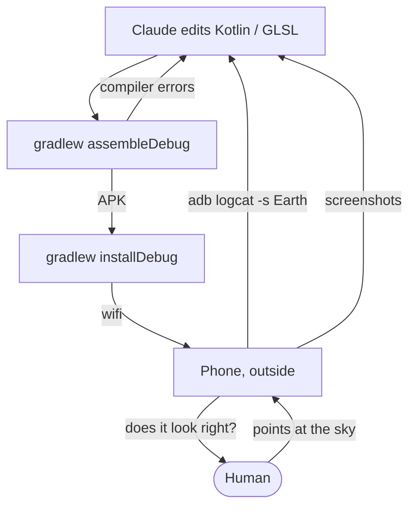
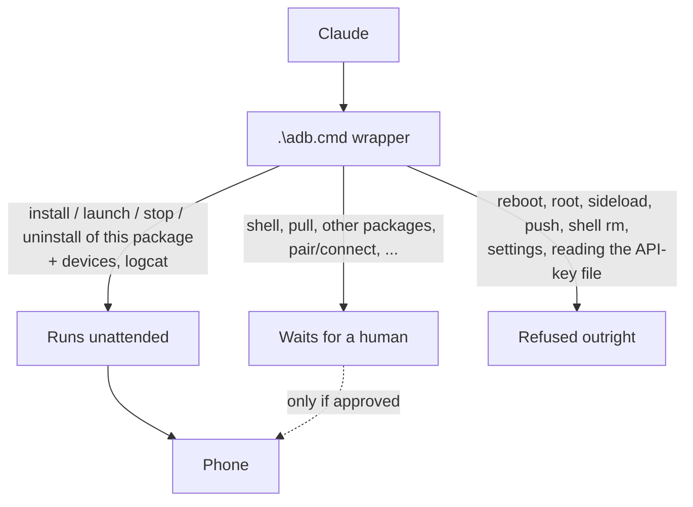

import Steps from "@/components/blog/Steps.astro";

[WorldLock](/worldlock-ar-window/) has never been opened in Android Studio. The entire development loop is three commands and an AI that runs them:

```plaintext
.\gradlew.bat assembleDebug     # compile
.\gradlew.bat installDebug      # deploy to the phone
.\adb.cmd logcat -s Earth       # watch the app's logs
```

That's it. That's the IDE.

## The trivial part: Claude does Android fine

The quiet realization of this project is that Android development is _extremely_ automatable once you drop the IDE. Everything Android Studio does behind buttons is a CLI command underneath, and CLI commands are exactly what a coding agent is good at:

- **Build errors are just text.** Claude runs `gradlew assembleDebug`, reads the Kotlin compiler output, fixes the code, runs it again. The compile-fix loop that eats an afternoon of clicking happens unattended.
- **Logcat is just text too.** The app logs everything interesting — geospatial accuracy, anchor state, a periodic cross-check of our coordinate math against ARCore's own anchors — under one tag. Claude greps it, spots `delta=0.4m` or `heading accuracy insufficient`, and reasons about what to change. Debugging a georegistration bug from a log line beats stepping through a debugger you can't attach to a phone that's outside.
- **Screenshots close the loop.** Phone screenshots land in a temp folder; Claude reads the pixels, notices the tower is leaning or the label is mispositioned, and edits the shader. It even cropped and placed the README gallery itself.
- **No toolchain install, even.** The build borrows the JDK 17 and Android SDK already bundled inside a Unity install on this machine — two paths in `gradle.properties` and `local.properties`. No JDK or SDK download; the only thing fetched is the Gradle distribution the wrapper pulls on first run.

Put together, the loop is a text pipeline with a phone in the middle of it. The only arrows a human touches are the ones on the far right:



The human's job shrinks to the three things an agent genuinely can't do: physically pointing the phone at the sky, judging whether the ember particles _look_ right, and occasionally re-running `adb connect` when the wireless link drops (`pair` and `connect` are deliberately not pre-approved).

One guardrail worth copying: the phone is reachable only through a wrapper script (`.\adb.cmd`) — plain `adb` isn't on PATH, and the permission rules key off the wrapper's name. The rules are three tiers, not two. Pre-approved: install, launch, stop, and uninstall of this one package, plus device listing and logcat (the `-s Earth` tag filter is convention, not enforcement). Anything unlisted — shell access, pulling files, other packages — waits for a human. And a hard deny list is refused outright even with a human present: reboot, root, sideload, push, `shell rm`, disabling packages, changing device settings — and reading `local.properties`, the file holding the ARCore API key. The agent can iterate freely on the app without ever holding a blank check to the device.



## The part that makes it work: wireless debugging

Here's the thing about developing an AR app: **you have to walk around.** Geospatial localization wants you outside, pointing the camera at buildings. A phone tethered to a desktop by a USB cable is a phone that can't do its job.

Android's wireless debugging (Android 11+) fixes this and takes about ninety seconds to set up:

<Steps>

1. On the phone: **Developer options → Wireless debugging → on**, then **Pair device with pairing code**.
2. On the PC: `adb pair <phone-ip>:<pairing-port>` and type the six-digit code. Once, ever, per PC.
3. Thereafter: `adb connect <phone-ip>:<port>` and the phone shows up exactly like a USB device.

</Steps>

From that point the loop is genuinely wireless: Claude builds and runs `installDebug`, the APK flies over wifi, you pick the phone up off the desk, walk to the window or out the door, and logcat streams back to the desk the whole time. Change a shader constant, `installDebug` again, the phone updates in your hand.

The pairing dance is the only fiddly part (the pairing port is different from the connect port, and both change when the phone reboots or drops off wifi — you re-run `adb connect` with the new port and move on). Minor tax. Pairing happens once; everything after it is a connect that occasionally has to be repeated:

```mermaid
stateDiagram-v2
  accTitle: Wireless adb states, from unpaired to connected
  accDescr: A phone starts unpaired. A one-time adb pair with the six-digit code and the pairing port moves it to paired. adb connect with the separate connect port makes it connected, which is where the whole build, install and logcat loop runs. A reboot or wifi drop sends it back to paired with a new port, and one more adb connect brings it back; pairing itself never has to be repeated.
  [*] --> Unpaired
  Unpaired --> Paired: adb pair ip:pairing-port + 6-digit code<br/>(once, ever, per PC)
  Paired --> Connected: adb connect ip:port
  Connected --> Connected: installDebug, logcat, screenshots
  Connected --> Paired: reboot or wifi drop<br/>(port changes)
  state "Paired (not connected)" as Paired
  state "Connected (looks like USB)" as Connected
```



In exchange, the test loop for an app whose whole premise is _stand somewhere real and look at the real world_ actually matches how the app is used.

## The takeaway

The stack for this project is: a phone, wifi, gradle, adb, and an agent that reads logs and screenshots. No IDE, no emulator, no cable. For a certain shape of app — small, native, hardware-in-the-loop — this is not a compromise workflow. It's just better.
