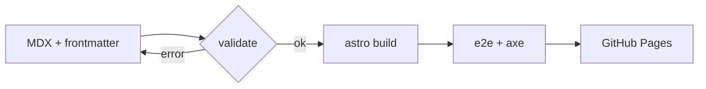

import Callout from "@/components/blog/Callout.astro";
import Figure from "@/components/blog/Figure.astro";
import Quote from "@/components/blog/Quote.astro";
import Aside from "@/components/blog/Aside.astro";
import Comparison from "@/components/blog/Comparison.astro";
import Steps from "@/components/blog/Steps.astro";
import Details from "@/components/blog/Details.astro";
import Tabs from "@/components/blog/Tabs.astro";
import Tab from "@/components/blog/Tab.astro";
import CodeBlock from "@/components/blog/CodeBlock.astro";
import { Image } from "astro:assets";
import pipeline from "./pipeline.png";

This blog is written mostly by coding agents. That changes what "easy to author" means: the
easiest thing for an agent is a small, explicit vocabulary with a validator that says exactly what
went wrong. This post is that vocabulary — every component I use to write here, in the order I
reach for them.

<Aside>
  The blog is an Astro static site. Posts are MDX files in their own directories, next to their
  images and any post-specific components.
</Aside>

## Why static first

A blog post is a document. Documents do not need a JavaScript framework to be read, and every
kilobyte of script is a kilobyte the reader downloads before the text settles. So the rule is
simple: a prose, code, or SVG post ships **zero** client JavaScript. React exists in this codebase,
but only for things that genuinely respond to input — and those get their own post.

<Comparison labels={["Static primitive", "Hydrated island"]}>
  <Fragment slot="a">

    - Rendered once, at build time
    - Works with JavaScript disabled
    - Styled by the same tokens as everything else
    - Zero bytes of script

  </Fragment>
  <Fragment slot="b">

    - Ships React plus the component
    - Needed for real interactivity (state, input, animation)
    - Loaded lazily, usually when scrolled into view
    - Justified per post, never by default

  </Fragment>
</Comparison>

Everything below is in the first column.

## Prose, code, and images

Plain Markdown covers most of a post: paragraphs, links, lists, emphasis, and fenced code with
syntax highlighting in both themes.

```ts
// Frontmatter dates are UTC calendar dates; render them only through this helper.
export function formatDate(date: Date, style: "medium" | "long" = "medium"): string {
  return new Intl.DateTimeFormat("en-US", { dateStyle: style, timeZone: "UTC" }).format(date);
}
```

Images live next to the post and go through Astro's image pipeline: resized variants, WebP,
`srcset`, intrinsic dimensions, and lazy loading, from a single line of Markdown.


When an image needs a caption or a wider measure than the text column, it goes in a `Figure`:

<Figure
  caption="The same image, wrapped in a Figure with a caption and a wide breakout."
  width="wide"
>
  <Image
    src={pipeline}
    alt="A schematic card on a grid background, rendered wider than the text column"
  />
</Figure>

Tables are plain Markdown too. On narrow screens they scroll sideways inside their own box instead
of pushing the page wider:

| Check                     | Where it runs   | Fails the build? |
| ------------------------- | --------------- | ---------------- |
| Frontmatter schema        | content loader  | yes              |
| Unknown series or tag     | content loader  | yes              |
| Duplicate/reserved slug   | `validatePosts` | yes              |
| axe WCAG 2.2 AA           | e2e             | yes              |
| Horizontal overflow @360w | e2e             | yes              |

## Emphasis without shouting

Two components handle "the reader should notice this", and they are deliberately different.

<Callout variant="tip" title="When to use which">
  A **Callout** interrupts the flow — use it for things a reader will regret skipping. An **Aside**
  steps out of the flow — use it for context that is interesting but optional.
</Callout>

<Callout variant="warning">
  Warnings look like this. There is also `danger` for "this will lose data" and `info` for neutral
  context. Five variants, and no post is allowed to invent a sixth colour.
</Callout>

Quotations get attribution and, when there is one, a source link:

<Quote
  cite="Fred Brooks, The Mythical Man-Month"
  href="https://en.wikipedia.org/wiki/The_Mythical_Man-Month"
>
  Plan to throw one away; you will, anyhow.
</Quote>

## Procedures and alternatives

Steps are an ordered list with a connector line — the Markdown stays a plain `1.` list, so it
degrades to exactly that anywhere else the text is shown.

<Steps>

1. Create `src/content/posts/<slug>/index.mdx` with valid frontmatter (a scaffold script does this).
2. Write the post using the primitives on this page. Put images and any components next to it.
3. Run `npm run validate` and `npm run build`. If anything is off — an unknown tag, a duplicate series order, a missing alt — the build says what and where.
4. Set `draft: false` and push. CI builds, runs the accessibility suite, and deploys.

</Steps>

Tabs are for _equivalent_ alternatives, never for hiding content. Arrow keys move between them, and
without JavaScript the panels simply stack.

<Tabs>
  <Tab label="Markdown image">

    ```mdx
    
    ```

  </Tab>
  <Tab label="Figure with caption">

    ```mdx
    <Figure caption="What the diagram shows." width="wide">
      <Image src={diagram} alt="Alt text that describes the image" />
    </Figure>
    ```

  </Tab>
</Tabs>

Long, optional material folds away:

<Details summary="The full frontmatter contract">

  - `title`, `description` (≤200 chars, used for search and social previews)
  - `publishedAt`, optional `updatedAt` (never earlier than `publishedAt`)
  - `series` (must exist in the registry) and `seriesOrder` (unique within the series)
  - `tags` (each must exist in the registry)
  - `draft` (drafts are dev-only: never built, listed, fed, or indexed)
  - optional `hero { src, alt }` and `ogImage`

</Details>

## Code that wants a name

Bare fenced code is the default. When a snippet is a file, or long enough that someone will want to
copy it, `CodeBlock` adds a header and a copy button — one small script for the whole page, not per
block.

<CodeBlock title="src/lib/url.ts">

```ts
/** Build a site-relative href that respects Astro's base. Never hardcode "/blog/". */
export function href(path: string): string {
  const base = import.meta.env.BASE_URL.replace(/\/$/, "");
  return `${base}${path.startsWith("/") ? path : `/${path}`}`;
}
```

</CodeBlock>

## Diagrams and math

Diagrams are Mermaid fences and are rendered to SVG **at build time** — the reader gets a picture,
not a script that draws one. Every diagram gets a sentence describing it, because a picture without
words is invisible to a screen reader (Mermaid's `accTitle`/`accDescr` lines add an accessible
title and description to the SVG itself). This one shows the path from an MDX file to a deployed page:



Math uses TeX syntax and renders through KaTeX, also at build time. Inline, reading time is
$\lceil w / 230 \rceil$ minutes for $w$ words; the display form of the same idea:

$$
t_{\text{read}} = \max\left(1, \left\lceil \frac{w}{230} \right\rceil\right)
$$

Neither of these adds a byte of JavaScript to the page.

## What is not here

There is no chart component, no carousel, no embed of the week. Each of those would be a
dependency and a maintenance promise, and none of them has a post that needs it yet. When one does,
the rule is: static HTML and CSS first, then SVG, then — only when something must respond to the
reader — a small React island. Part 2 of this series is about that last case.
