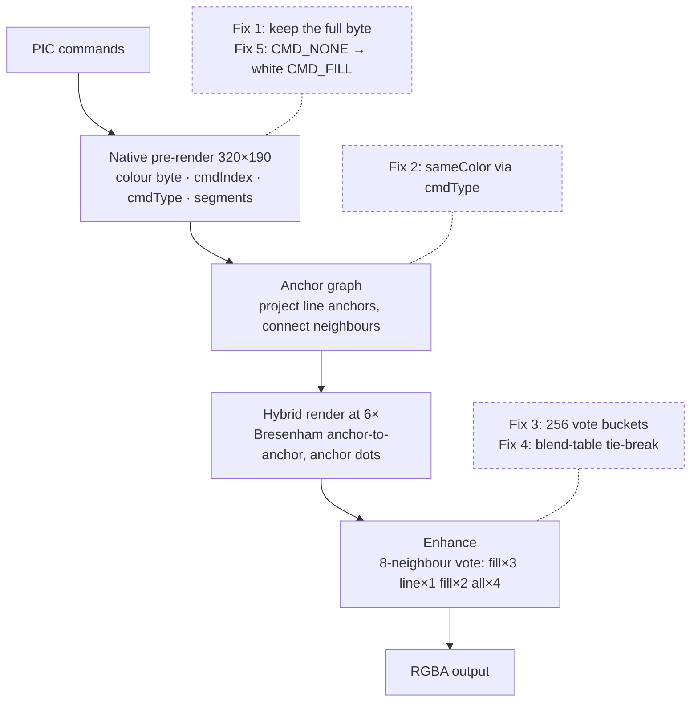
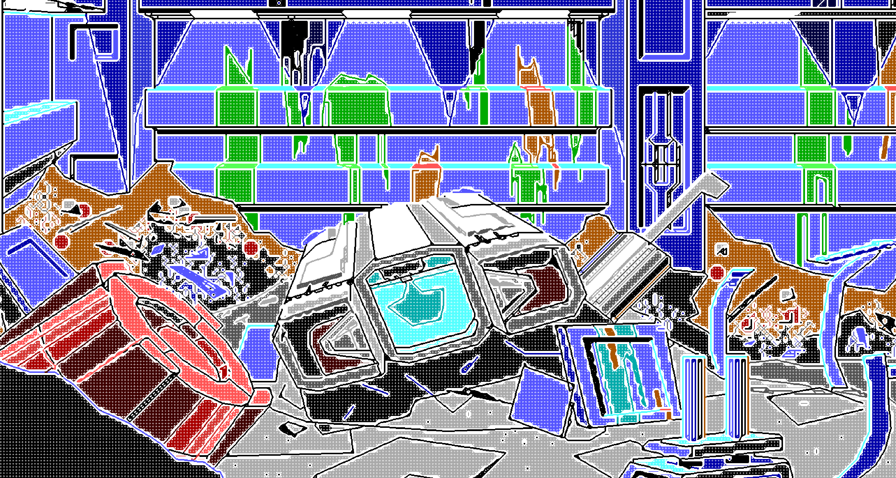
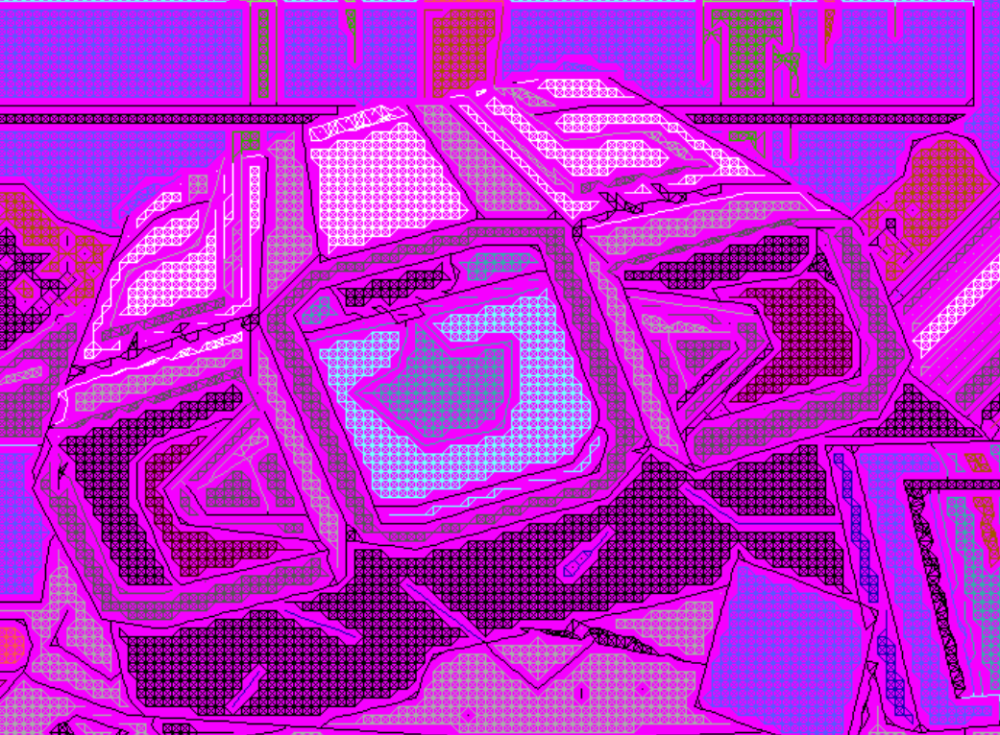

import Figure from "@/components/blog/Figure.astro";
import VizFigure from "@/components/blog/VizFigure.astro";
import Callout from "@/components/blog/Callout.astro";
import AnchorProjection from "./anchor-projection.svg";
import BytePacking from "./byte-packing.svg";
import SplatCoverage from "./splat-coverage.svg";
import sweepSnap from "./sweep-snap-blend-vs-omyac.svg";
import sweep1 from "./sweep-original-vs-omyac-1.svg";
import sweep2 from "./sweep-original-vs-omyac-2.svg";
import sweep3 from "./sweep-original-vs-omyac-3.svg";
import sweep4 from "./sweep-original-vs-omyac-4.svg";
import sweep5 from "./sweep-original-vs-omyac-5.svg";
import sweep6 from "./sweep-original-vs-omyac-6.svg";
import sweep7 from "./sweep-original-vs-omyac-7.svg";

For the past few months, the SCI0 PIC pipeline has mostly been a story of incremental refinement. [`snap-blend`](/sci0-pic-upscaling-native-render-oracle/) improved pixel-space scaling with leak-detection heuristics, dither-aware resolution, and dual-layer compositing. Each iteration fixed a real class of artefacts. Each iteration also hit the same ceiling: pixels alone only carry so much information.

When [OldManYellsAtCode1](https://github.com/OldManYellsAtCode1/agi-up) published [`agi-up`'s `hybrid.h`](https://github.com/OldManYellsAtCode1/agi-up) ([walkthrough video](https://www.youtube.com/watch?v=z9Yp9S23ICo)), it reframed the problem completely. Instead of asking "what colour should this pixel become?", the algorithm asks "which command created this pixel in the first place?"

That distinction changes everything.

Lines become geometric entities instead of stair-stepped pixel masks. Fills become topological regions instead of colour blobs inferred heuristically. Anchors sit on projected line segments at sub-cell precision rather than at the centre of integer grid cells.

This post documents the SCI0 port, the five engine-specific fixes that made it viable, and why the project is moving away from `snap-blend` entirely. (A [sibling post](/agi-up-as-a-reference-renderer/) covers using `agi-up` as a reference renderer; this one is about making its algorithm native.)

## Why port at all

<Figure caption="snap-blend (left) against omyac-upscaler (right) on the same PIC; the wipe sweeps back and forth so the same region can be read under both.">
  
</Figure>

`snap-v5-blend` already ships and renders. The omyac upscaler was initially registered alongside it as a separate strategy so the pic-dev sweep page could compare them side-by-side on the same PICs — a hedge in case omyac didn't pan out. The hedge wasn't needed. Once the five fixes below were in, omyac was decisively better on every PIC we've put it against. The project is moving to it as the default upscaler and snap-blend is on its way out.

What omyac-upscaler buys at the algorithmic level — and what every snap-v\* iteration was trying to recover heuristically from a pixel-only representation:

- **Lines at sub-cell precision.** Two adjacent native cells owned by the same polyline command project their anchors onto the segment between them at sub-cell precision. The Bresenham stroke between those anchors traces the actual line geometry, not a block-expansion of the line's cell mask. Diagonals stop looking staircased.
- **Region identity through command provenance.** Each native cell tracks which command rasterised it. Fill regions are connected components of same-command-or-same-colour cells, and the enhance kernel votes inside that topology. Heuristic leak detection isn't required — the algorithm knows what counts as "inside" because the command structure says so.

The pixel-space approach was always going to hit a ceiling. Reasoning about commands and topology instead of pixels lifts that ceiling decisively.

## Step 1: port to TypeScript first, fix the gaps after

The first commit was the algorithm pass-for-pass: types ported, control flow ported, no semantic changes. It compiled and produced output immediately, and that output was _almost_ right — clear diagonal lines, recognisable shapes, plausible fills. Most of the image looked correct enough to feel like the port was done.

Almost-right images are dangerous because they hide structural problems behind partial correctness. The wrongness was concentrated in regions where SCI0's colour conventions diverge from AGI's, and most of it could be made visible only by checking the algorithm against PICs that exercised those conventions.

The next two sections describe the algorithm and what the first port looked like running on real SCI0 input. The section after that is the five places SCI0 needed adapter logic and what each fix is.

## How the algorithm works (the parts that ported cleanly)

The C reference operates in three layers: a native pre-render to gather command provenance, an anchor graph to decide connection topology, and a hybrid render at the upscaled resolution that draws anchor-to-anchor strokes and then iteratively expands them into solid regions. The structure of the port preserves all of this verbatim.

The whole pipeline, with the places where the SCI0 fixes attach, looks like this:



### Native pre-render

Replay every PIC command into a 320×190 buffer using the project's existing rasterisers. Wrap the per-pixel plot callback so it also records the current command's index and type (line vs fill) into parallel buffers. For polyline commands, store the segment endpoints so the anchor pass can reproject onto them later.

The output of this pass is what the rest of the algorithm reasons over: for every native cell, what command rasterised it, what colour byte resulted, whether the command was a line or a fill, and (for line commands) what segments the line consists of.

### Anchor projection

Every native cell gets one anchor — a point in upscaled coordinates. By default it sits at the cell centre. For cells owned by a line command, the anchor is projected onto the nearest segment of that command, in upscaled space:

```typescript
function projectOntoSegment(cx, cy, sx, sy, ex, ey) {
  const dx = ex - sx,
    dy = ey - sy;
  const len2 = dx * dx + dy * dy;
  let t = len2 > 0 ? ((cx - sx) * dx + (cy - sy) * dy) / len2 : 0;
  t = Math.max(0, Math.min(1, t));
  return [Math.round(sx + t * dx), Math.round(sy + t * dy), squaredDistance];
}
```

For each segment of each line command, walk every native cell whose command provenance is that command and try the projection. Keep the projection point with the smallest squared distance to the cell centre. The result: anchors for line cells sit on the lines they belong to, at sub-cell precision.

<Figure caption="The same six native cells rasterised by one line command. Left: anchors at cell centres, so the anchor-to-anchor stroke reproduces the staircase of the cell mask. Right: each anchor projected onto the command's segment (dotted ticks show the move), so the stroke is the line the artist drew.">
  <VizFigure
    name="Cell-centre anchors versus anchors projected onto the line segment"
    summary="Two panels of the same shaded cells along a diagonal. On the left, grey anchors sit at cell centres and the stroke between them alternates diagonal and flat runs. On the right, the anchors have slid onto the true segment and a single straight stroke passes through all of them."
  >
    <AnchorProjection class="h-auto w-full max-w-2xl" aria-hidden="true" />
  </VizFigure>
</Figure>

This is the move that gives the upscaler its cleaner diagonals. Block-expanded renderers can't do this — they only know the cell mask, not the underlying geometry that produced it. omyac retains the geometry through the segments buffer and uses it where it matters.

### Endpoint detection and line-anchor connection

A line cell is an _endpoint_ if fewer than 2 of its 8 neighbours are owned by the same command. Endpoints get extra cross-command connection logic; interior line cells just connect to their continuation.

Within a single line command, an anchor connects to every same-command neighbour in any of 8 directions. At endpoints, the connection logic extends across commands: if the endpoint's neighbour is a different line command of the same colour, connect to one such neighbour per foreign command, preferring directions that have a same-command neighbour through the opposite side (so the line continues smoothly). If there's no forward connection at all, fall back to connecting outward in the travel direction so the line trails off the canvas edge cleanly.

This is what lets two polylines meet at a junction and produce smooth geometry — the anchor at the junction connects to both, and the Bresenham in the hybrid render draws clean diagonals through it.

### Fill-anchor connection with flanking suppression

Fill (and background) anchors connect to same-colour neighbours, with one structural rule: a diagonal connection is blocked if both flanking cardinal cells are line cells. This is the diagonal-flanking suppression, and it prevents fill regions from squeezing through line junctions where they shouldn't.

### Hybrid render



At the upscaled resolution, draw a Bresenham line between each pair of connected anchors. The stroke uses a half-A / half-B colour scheme: the first half is the source cell's colour, the second half is the destination cell's. Two same-colour cells produce a uniform line; two different-colour cells produce a half-and-half transition at the midpoint.

After all anchor-to-anchor connections, run a pass for connections that leave the canvas (so lines trail off cleanly at the boundary). Finally plant anchor dots — single-pixel writes at each anchor position — so they appear on top of any Bresenham line that crossed through them.

The output at this point is a sparse wireframe: anchors connected by Bresenham strokes against a mostly-empty background.

### Enhance: neighbourhood-vote expansion

The wireframe is sparse — at 6× upscale, each native cell becomes a 36-pixel region, of which only a handful are written by the wireframe. The enhance kernel fills the rest by neighbourhood voting: for each empty pixel, look at its 8 neighbours, count colour votes, pick the winner.

The kernel takes a mode parameter that controls which neighbour types vote: `fill` mode counts fill neighbours and ignores lines; `line` mode counts line neighbours and treats fill pixels as overwriteable; `all` mode counts both. A `suppressFill` rule kicks in when 3+ line-type neighbours are present, blocking fill votes so lines aren't overrun at junctions.

Running the kernel several times with a sequence of modes (the C reference's default is `fill × 3, line × 1, fill × 2, all × 4`) propagates fill regions first, then reclaims line junctions, then converges the remainder.

## What the first port looked like

After porting these passes pass-for-pass into TypeScript, the output reconstructed obvious geometry — sharp diagonals where snap-blend had staircases, solid regions where snap-blend had stippling. But four specific classes of cells came out wrong, all visible side-by-side against snap-blend on the same PIC:

- Dithered regions broke into noise. SCI0's doubled-nibble pairs (`0x3b` = a cyan-and-light-cyan dither pair) didn't survive the vote process; every dithered cell was either treated as a unique colour with no neighbours, or got nibble-masked into a solid that destroyed the pair.
- Solid-white fills and white background regions both rendered as the unfilled-sentinel colour. The byte `0xff` is solid white _and_ the initial sentinel value; the algorithm couldn't tell them apart.
- Tied votes on dithered regions produced blocky arbitrary winners instead of smooth gradients between colour regions.
- Large background regions of intended-white got voted into the colour of whatever surrounded them, because the algorithm interpreted "no command plotted here" as a gap to be inferred rather than as legitimate white.

All four symptoms had the same shape of cause: assumptions baked into the C reference that hold in AGI's colour model and command conventions but not in SCI0's. Each one resolved into a small local fix at the encoding boundary.

## Step 2: the five fixes

### Fix 1: preserve SCI0's doubled-nibble bytes

AGI stores pixel colour as a raw 4-bit palette index — one byte per pixel, the byte _is_ the colour. SCI0 uses the same byte width but **packs two 4-bit colours into it**: `(high << 4) | low`. Solid colours have matching nibbles (`0xff` = white); dithered colours don't (`0x3b` = a cyan + light cyan pair, rendered as alternating-pixel checkerboard at native).

<Figure caption="One byte per pixel in both engines, but SCI0 packs two nibbles into it — and its white byte is also its “never painted” sentinel.">
  <VizFigure
    name="AGI versus SCI0 pixel byte layout"
    summary="AGI uses only the low nibble of the byte, so 0xff is out of range and unambiguously means untouched. SCI0 uses both nibbles: matching nibbles are a solid (0x33), differing nibbles are a dither pair (0x3b), and 0xff is both solid white and the untouched sentinel — the collision that fixes 2 and 5 resolve."
  >
    <BytePacking class="h-auto w-full max-w-2xl" aria-hidden="true" />
  </VizFigure>
</Figure>

The C reference reads the byte and uses it as colour identity for every equality check, connection rule, and vote bucket. That works in AGI because each byte means exactly one thing. In SCI0, if you mask the byte down to a nibble you destroy the dither pair; if you leave it intact you have to broaden everything downstream to a 256-byte space.

**Fix:** preserve the full doubled-nibble byte. Treat each unique byte as a unique colour. Every cell's identity flows through downstream passes as-is.

```typescript
refPixel[i] = result.visible.pixels[i]; // full byte, no masking
```

### Fix 2: disambiguate solid white from the unfilled sentinel via cmdType

SCI0's visible buffer is initialised to byte `0xff` as a sentinel meaning "no command has plotted here yet." That's the _same byte_ as solid white: `(15 << 4) | 15`. AGI doesn't have this collision because its valid colour bytes run `0x00`–`0x0f` and `0xff` is unambiguously sentinel.

In SCI0, byte equality alone can't tell whether `0xff` means "this pixel was painted white" or "this pixel was never touched." Every byte-equality check in the algorithm potentially gets the wrong answer.

**Fix:** carry the disambiguation out-of-band. The pre-render already builds a `cmdType` buffer (`CMD_NONE` / `CMD_LINE` / `CMD_FILL`); use that for "is this filled?" checks, not byte equality.

```typescript
function sameColor(ref, a, b) {
  const tA = ref.cmdType[a];
  const tB = ref.cmdType[b];
  if (tA === CMD_NONE || tB === CMD_NONE) return tA === tB;
  return ref.refPixel[a] === ref.refPixel[b];
}
```

The byte carries colour; the cmdType buffer carries provenance. Concerns separated.

### Fix 3: grow the vote bucket array to 256

Downstream of fix 1, the kernel's vote counter needs to hold tallies for any of 256 possible bytes, not just 16.

```typescript
const count = new Int32Array(256); // was Int32Array(16)
```

This sounds trivial but it's what lets dither pairs vote in their own buckets without being conflated into nibble-masked solids. With the 16-bucket version the enhance kernel couldn't even talk about dither.

### Fix 4: tie-break using a perceptual blend table

When multiple bytes are tied for the vote winner, the C reference averages their RGB values and snaps to the nearest palette entry. In AGI's 16-entry palette that's almost always sane because the entries are well-spaced. In SCI0's 256-byte space the nearest-RGB calculation gets weird if you do it naively — averaging raw nibbles or doubling the byte loses the perceptual relationships between dither pairs and their solid endpoints.

**Fix:** reuse the project's existing perceptual blend table (an okLab-mixed RGB lookup per doubled-nibble byte, already in use for snap-blend's dither resolution). For each tied byte, look up its blended RGB, average those, then search all 256 entries (not just the tied set) for the byte whose entry is nearest.

```typescript
for (let k = 0; k < ntied; k++) {
  const blend = BLEND_TABLE[tied[k]];
  sumR += blend & 0xff;
  sumG += (blend >>> 8) & 0xff;
  sumB += (blend >>> 16) & 0xff;
}
const avgR = sumR / ntied,
  avgG = sumG / ntied,
  avgB = sumB / ntied;
// search all 256 bytes for the entry nearest the average → winning byte
```

Searching all 256 bytes (not just the tied set) is the part that makes the tie-break high-quality. A tie between solid cyan and solid magenta can resolve to an intermediate dither pair like `0x35` rather than arbitrarily picking one of the originals.

This isn't strictly required for correctness — without it the algorithm still converges — but tied regions look obviously wrong without it. Pulling it in for free was an easy win.

### Fix 5: untouched cells mean "white background," not "gap"



This is the most paradigm-specific of the five fixes, and the one whose absence produced the most visible damage.

AGI artists generally cover the canvas — fills paint every region, including background. The C reference relies on this: a cell with no command provenance (`cmdType === CMD_NONE`) is treated as a _gap_; no anchor dot is planted for it, and the enhance kernel infers its colour from neighbour votes.

SCI0 doesn't follow that convention. The visible buffer initialises to byte `0xff` (white) and SCI0 artists routinely leave large regions at that initial state — the _intent_ is "this region is white." If those cells reach the downstream passes as `CMD_NONE`, the algorithm interprets them as gaps and votes them away: adjacent coloured regions bleed across what should be background, and entire white skies turn into the colour of whatever surrounded them.

**Fix:** at the end of the native pre-render, promote every cell still at `CMD_NONE` to `CMD_FILL` with the visual buffer's current byte (always `0xff` here, by SCI0's init):

```typescript
for (let i = 0; i < W * H; i++) {
  if (cmdType[i] !== CMD_NONE) continue;
  cmdType[i] = CMD_FILL;
  refPixel[i] = result.visible.pixels[i]; // 0xff
}
```

After this sweep the ref has no `CMD_NONE` cells. Background regions are first-class fill anchors: the fill-connection pass builds a dense white-to-white lattice across them, the hybrid render plants white anchor dots at every background cell centre, and the enhance kernel votes them as solid white instead of inferring from coloured neighbours. The 6×6 hybrid block of every native-background cell ends up correctly white.

The fix is one loop, but it's the only one of the five that isn't about how SCI0 encodes colour — it's about what "no command plotted here" _means_ in each engine's PIC convention.

## A diagnostic worth keeping

The breakthrough that pinpointed fix 5 was a one-line change to the PNG writer: render any pixel whose `cmdType === CMD_NONE` as hot pink (`#ff00ff`) instead of resolving it through the blend table. SCI0's palette doesn't contain hot pink, so every pink pixel in the output is unambiguously a cell the algorithm considered null. Side-by-side with the source PIC's actual white regions, the bug was instantly visible — large swaths of pink where solid white should have been.

<Callout variant="tip" title="Keep the diagnostic on">
  The diagnostic stays on as the default rendering. A final null-pixel mode-fill safety sweep runs after enhance to guarantee no `CMD_NONE` cells remain in the output (taking the mode of 8 neighbours, defaulting to black if no neighbour has data), so pink should only appear if something genuinely went wrong upstream. Any future regression that produces stranded null cells will be immediately obvious in the pic-dev sweep page rather than hiding behind SCI0's "render `0xff` as white" convention.
</Callout>

## What the output looks like after the fixes

Each comparison below wipes between the original 320×190 PIC (left label) and the omyac-upscaler output at 6× (right label).

<Figure caption="Scrapyard exterior: a toppled ACME cylinder and a cyan hull with lettering.">
  
</Figure>

<Figure caption="Scrapyard with a magenta stairway and a teal dome.">
  
</Figure>

<Figure caption="Interior with two lit arches and a skeletal machine.">
  
</Figure>

<Figure caption="A red cylindrical corridor seen side-on.">
  
</Figure>

<Figure caption="Hangar with a green-jewelled machine and a red-and-cyan gantry.">
  
</Figure>

<Figure caption="Cavern floor with a crashed grey ship, a white pod and yellow lamp-posts.">
  
</Figure>

<Figure caption="Blue ice cavern with a green vehicle and thin outline geometry.">
  
</Figure>

With all five fixes applied the upscaler produces output that:

- preserves dither at native fidelity through the algorithm's logic (fix 1),
- handles the byte/sentinel collision uniformly across every equality check (fix 2),
- resolves vote ties to perceptually-correct intermediate dithers (fix 4),
- doesn't confuse legitimate solid white with unfilled gaps anywhere downstream (fixes 2 + 5),
- and keeps SCI0's "white background" convention intact across the upscale (fix 5).

Diagonals are clean. Dithered regions are smooth. Background whites are white. Junctions where multiple polylines meet produce continuous geometry rather than stair-stepped block expansions. Solid-fill regions match the existing perceptual dither rendering for the same input bytes, with cleaner line geometry layered on top. The difference compared to snap-blend is not subtle — on every PIC the sweep page can show, the omyac output looks like it was rendered by an engine that _understood_ the picture rather than one that was trying its best with the pixels it got. We're committing to it as the default.

## Still to validate: line weight against animated views

PICs are only half the visual surface. Views — sprites, characters, props — come in as upscaled GIFs and composite on top of the PIC at runtime. snap-blend's line strokes are visibly thicker than omyac's, and the existing views were authored implicitly against that thicker line weight. omyac's cleaner, thinner lines may look out-of-balance next to the views in motion, even though the PIC itself is unambiguously better.

If that turns out to be a problem the fix is shallow: widen omyac's stroke — plant larger anchor dots, draw thicker Bresenham strokes, or post-thicken line-type pixels in a final pass. None of those are deep algorithmic changes; they're tuning knobs against a chosen target weight. But the right value can only be picked by eyeballing the composite of PIC + views in motion, which is the eval that's still to come. If the answer is "thinner lines are fine" we ship as-is; if it's "thinner lines clash" we add a stroke-width parameter and tune until the composite reads right. Either way it isn't a blocker for the migration — it's the last tuning step in front of it.

## What still doesn't work: small highlights at 6× upscale

One honest limitation: **isolated single-cell highlights don't fully expand at 6× scale.**

The C reference's enhance kernel has an isolated-pixel pass that floods a colour anchor's value into the surrounding 8 pixels. At AGI's typical 2–3× upscale a single 8-neighbour splat covers a whole cell's territory. At 6× upscale a cell's territory is 36 pixels and the splat covers only 25%. Subsequent vote passes can't grow the splat against the surrounding cells of different colour — the splat's outer ring loses every vote to the more-numerous neighbours from the next cell.

<Figure caption="How much of one native cell's upscaled territory the 3×3 isolated-pixel splat covers, by upscale factor. Above each bar, the splat drawn inside a cell of that size.">
  <VizFigure
    name="Share of a cell covered by the 3×3 isolated-pixel splat, 2× to 6×"
    summary="At 2× and 3× the nine-pixel splat covers the whole cell. Coverage then falls to 56% at 4×, 36% at 5× and 25% at 6× — the factor this port runs at — which is why single-cell highlights come out as small dots."
    data={{
      caption: "Cell territory covered by a 3×3 splat, by upscale factor",
      columns: ["Upscale factor", "Cell size (px)", "Covered by 3×3 splat"],
      rows: [
        ["2×", "4", "100%"],
        ["3×", "9", "100%"],
        ["4×", "16", "56%"],
        ["5×", "25", "36%"],
        ["6×", "36", "25%"],
      ],
    }}
  >
    <SplatCoverage class="h-auto w-full max-w-2xl" aria-hidden="true" />
  </VizFigure>
</Figure>

Visually: small white sparkles and metallic glints that the SCI0 artist drew as 1-cell highlights render as 1–3 pixel dots rather than 6×6 blocks. They look like deliberate bright pinpoints; the artist meant a 6×6 block.

This isn't a bug in the algorithm — it's the algorithm running outside its design envelope. The port doesn't compensate. Compensating would mean adding a pass that isn't in `hybrid.h`, and the shipping criterion for the port is "C algorithm + the colour-model fixes, nothing else." If the symptom matters for a future use case, three realistic paths are: pre-expand small-cluster cells before enhance, plant 3×3 anchor footprints instead of 1×1, or drop the upscale factor to 2–3×.

## Learnings to pass back to OldManYellsAtCode1

The structural ideas of [`agi-up`](https://github.com/OldManYellsAtCode1/agi-up) are remarkably robust across colour models. Anchor projection onto segments, endpoint detection, the cardinal/diagonal connection rules with flanking suppression, the half-A/half-B Bresenham, the 8-neighbour vote kernel with its mode-aware suppress rule — all of this carried over to SCI0 essentially as-written. The friction was uniformly at the data-encoding layer: how the target format packs colour into bytes, what the initial buffer state means, what the canvas-coverage convention is. None of it touched the algorithm's geometric or topological reasoning.

A few things worth flagging for the next port:

- **Encode colour identity out-of-band.** Don't put "is this filled?" into the byte value. Keep the byte for colour and a separate buffer for command provenance. Any time the target format has a single byte that means more than one thing semantically — solid + dither pair, white + sentinel — separating the concerns from day one removes a class of bugs.
- **Audit paradigm conventions, not just data formats.** AGI artists fully cover the canvas; SCI0 artists rely on initial-state defaults. Wherever the algorithm asks "what does this cell mean?", check whether the answer is paradigm-dependent. If it is, normalise it at the earliest point in the pipeline. The fix-5 sweep at the end of pre-render is the canonical example.
- **Trust the host project's perceptual machinery.** If the target project already has a perceptually-blended dither table, use it for tie-breaks. The C reference's nearest-RGB metric works in AGI because the palette is small enough that the metric doesn't matter; in a richer colour model it matters a lot.
- **Pick an upscale factor the algorithm was designed for, or accept a small-feature gap.** The enhance kernel's isolated-pixel pass assumes a cell's territory is small enough that an 8-neighbour splat fills most of it. At 6× that ratio breaks. The algorithm doesn't fall apart — most of the image is fine — but the limitation is real and should be sized up before committing to a particular upscale factor.

Thank you for [`agi-up`](https://github.com/OldManYellsAtCode1/agi-up) (and the [walkthrough video](https://www.youtube.com/watch?v=z9Yp9S23ICo) that explained how to read the algorithm). The geometric and topological reasoning works across colour models. The only adapter is at the surface — colour encoding and canvas-coverage convention — and once those are normalised at the boundary the rest of the algorithm is a black box that produces correct output.

## Always-shippable as a constraint

The port stayed shippable from the first compile. Each fix was a few lines in a single function, applied incrementally, rendered side-by-side against snap-blend in the pic-dev sweep page after every change. There was never an intermediate state where the renderer didn't render. The hot-pink diagnostic was added the same week as fix 5; nothing about the diagnostic blocked anything else; nothing about the fix invalidated work that depended on the previous behaviour.

That worked because the algorithm's structure (provenance + anchors + topology + voting) is decoupled from its encoding (how a colour fits in a byte). Encoding fixes only touched the encoding boundary. Algorithm fidelity was never up for negotiation — the C reference passes intact, with adapter logic at the surface layer.

The strategies coexisted deliberately during the port. The pic-dev sweep page compared omyac and snap-blend at the same time on the same PICs because both registered through the same strategy interface, consumed the same SCI0 PIC bytestream, and produced the same RGBA output shape. Adding the port was a strict superset of existing functionality — nothing was replaced and nothing was torn out _while the port was in flight_. The verdict on PIC rendering is in: omyac wins, and it becomes the default. snap-blend stays registered through the views-against-line-weight eval as a fallback comparison; once that lands and any stroke-width tuning is settled, snap-blend retires.

There's a tempting alternative path where you treat the port as a big-bang rewrite, branch the renderer pipeline, and merge it back when "everything works." Every issue from fixes 1–5 in this post would have been discovered during the merge instead of during incremental development, which means they would have been argued about in aggregate rather than understood individually. A small, registered, side-by-side strategy makes it impossible to confuse "the algorithm is broken" with "this specific encoding boundary is broken" — they're separable because the artefact is visible against a known-good comparison every time.

That's the part worth keeping for future renderer work: the next strategy should also land registered, comparable, and always-shippable from the first commit, even if the eventual outcome is replacing what came before. Big-bang rewrites of rendering pipelines are a category of work that doesn't pay back the volatility cost; _eventual_ replacement after side-by-side validation does.
