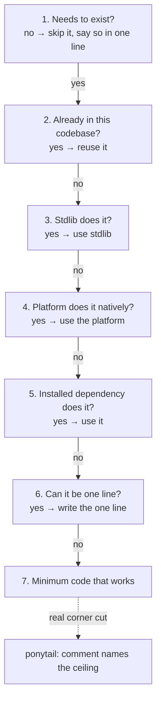
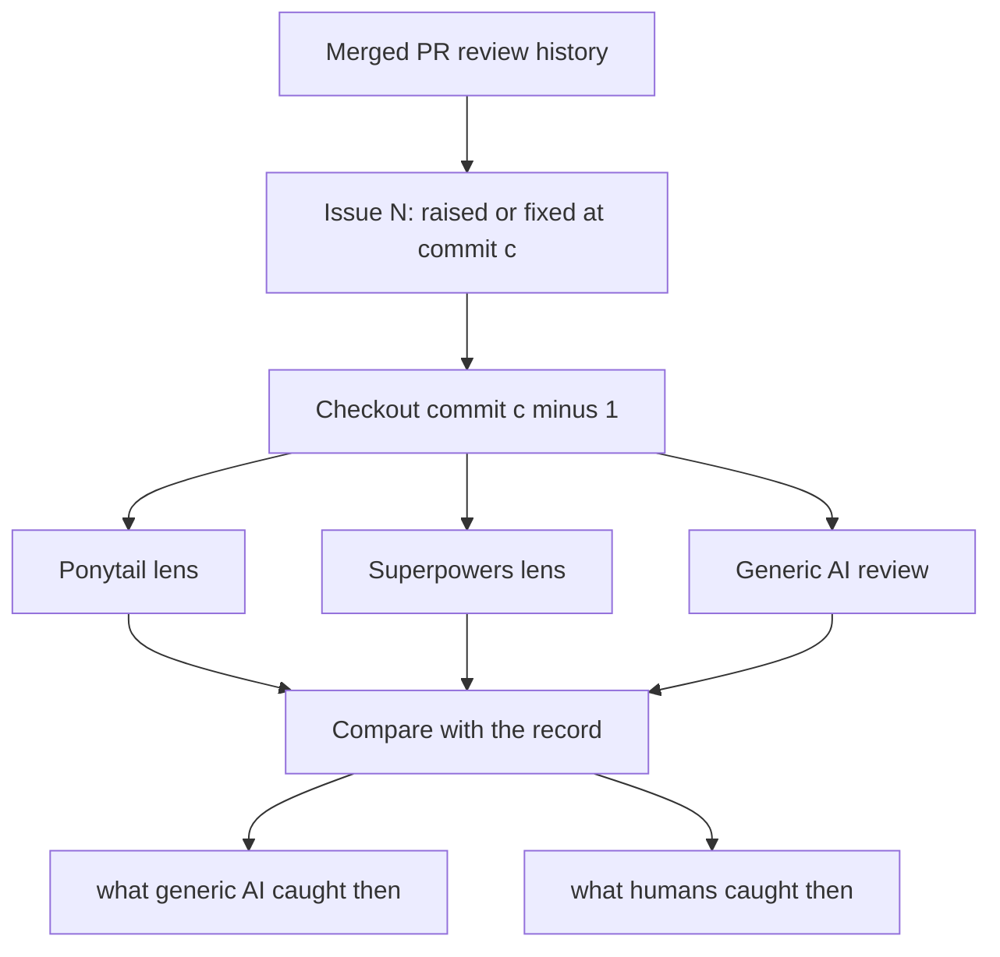

import Figure from "@/components/blog/Figure.astro";
import VizFigure from "@/components/blog/VizFigure.astro";
import LensReach from "./lens-reach.svg";

[WorldLock](/worldlock-ar-window/) was written with Claude Code running a mode called **ponytail**. The pitch: the AI role-plays a lazy senior developer. Lazy meaning efficient, not careless — the kind of engineer who has been paged at 3am for someone else's clever abstraction and now believes the best code is the code never written.

## How it works

Ponytail is a skill that stays active every response and forces a ladder of questions before any code gets written:

1. Does this need to exist at all?
2. Does something in this codebase already do it?
3. Does the standard library do it?
4. Does the platform do it natively?
5. Does an already-installed dependency do it?
6. Can it be one line?
7. Only then: write the minimum code that works.

Plus standing rules: no interfaces with one implementation, no config for values that never change, no scaffolding "for later," deletion over addition. When it _does_ cut a real corner, it has to leave a `ponytail:` comment naming the ceiling and the upgrade path — so the shortcuts are a searchable ledger instead of landmines.

The ladder is a chain of early exits: the first rung that holds ends the climb, and new code is what's left when nothing else did.

## What it did to this codebase

You can see the fingerprints everywhere:

- **8 files, ~1,900 lines, one AR dependency** (plus the Play Services location library ARCore's Geospatial mode requires). No androidx, no DI framework, no ViewModel, no coroutines library. The ISS fetcher is a plain `Thread` and `java.net.URL`. Geocoding is the platform `Geocoder`. Settings persistence is `SharedPreferences`. Every one of those is a rung-3/rung-4 answer where a typical Android codebase reaches for a library.
- **The UI is built in code.** No XML layouts, no resource inflation — the settings sheet is a `LinearLayout` assembled in one function, because that was shorter than the "proper" way and there's exactly one screen.
- **Seven tower styles, one renderer.** Instead of a class per style, there's a `Style` data table (strand count, twist, blend mode, a radius-profile lambda) and one shader with a mode switch. Adding a style is adding a table row.
- **The debt is labeled.** Search the repo for `ponytail:` and you get the honest list — four comments, in-place, greppable. That's the whole backlog of deferred work.

Here is that ledger, in full:

| Where               | What was deferred                                                                                          | The comment's own upgrade path                              |
| ------------------- | ---------------------------------------------------------------------------------------------------------- | ------------------------------------------------------------ |
| `GlobeRenderer.kt`  | The globe ray-cast hits a sphere through local sea level, not the true WGS84 ellipsoid                     | "Upgrade to an ellipsoid ray cast if either ever matters"   |
| `Geo.kt`            | Sea level is a hand-set constant (the EGM96 geoid offset at Seattle)                                        | "nudge if the horizon still reads high or low in the field" |
| `MainActivity.kt`   | Tower width is a heuristic: an angular floor so distant cities stay visible, a distance cap so near ones don't engulf you | tune in the field                                           |
| `MainActivity.kt`   | The first-fix accuracy-gate constants                                                                       | "tighten if towers look mis-aimed in the first seconds"     |

## A harder test: replaying a real PR

Fingerprints on one hobby codebase are suggestive, not proof. So I've also been testing ponytail alongside Superpowers on my own projects, including a retrospective test against a real merged PR: check out the code at the commit immediately before each issue was raised or fixed, run the review lenses cold without describing the expected finding, and compare against what generic AI review and human review actually caught at the time. Same underlying model throughout — the only real variable was the review skill, its instructions, and its context. Replays of actual review history, not constructed examples.

The result was fairly compelling: different lenses found different classes of problems, including some both generic AI review and human review missed.

**Ponytail identified code that should not have existed.** The PR introduced a custom drag-state hook on top of react-dropzone. A generic AI reviewer described the implementation as sensible. The ponytail-style review flagged the hook as the highest-priority issue — it duplicated functionality the library already provides. A human reviewer raised the same concern several days later; the hook was removed and the diff got smaller. A documentation-grounded variant went further, inspecting the library source and naming the exact API the author ultimately used. That's the ladder's rung 5 ("already-installed dependency solves it?") doing review work.

**Superpowers identified a runtime bug outside the diff.** The PR started exercising an existing React hook whose internal Map was initialized in a `useEffect`, so it returned null on first render. The buggy file wasn't touched by the PR, so a changed-code-only review would never look at it — and none did; the bug only surfaced later in manual testing when file thumbnails failed to render. The Superpowers-style review traced the first render before effects run, followed the imports into unchanged code, and identified the exact file, line, root cause, and fix the author later shipped. The panel also caught a bug that's _still_ in the merged code — rejection state set on drag-enter is never reset when the drag ends. Three of four lenses flagged it independently; no human did.

The two findings differ in where the lens looked, not just what it saw. A diff-only reviewer stays inside the changed lines; ponytail looks sideways at what is already installed; Superpowers follows an import out of the diff into code nobody touched.

<Figure caption="Where each lens looked. Generic review stayed inside the diff. Ponytail compared the new hook against the installed react-dropzone. Superpowers followed the render path from the diff into an unchanged hook and caught the first-render null.">
  <VizFigure
    name="Reach of the three review lenses on the replayed PR"
    summary="Schematic of a codebase box containing a PR-diff box with a new drag-state hook and, outside the diff, an unchanged hook whose Map is set in an effect; a react-dropzone box sits in the dependencies. The generic reviewer's arrow points only at the diff and reports it as sensible. Ponytail's arrow runs from the new hook to react-dropzone, labelled already provided, delete. Superpowers' arrow runs from the diff along an import into the unchanged hook, labelled null on first render."
  >
    <LensReach class="h-auto w-full max-w-2xl" />
  </VizFigure>
</Figure>

## So is it any good?

**Mostly yes, with two honest caveats.**

The yes: the discipline compounds. Every abstraction you don't add is an abstraction you never refactor, document, or debug. For a solo project with one screen and one contributor, ponytail's output is dramatically easier to hold in your head — 1,900 lines _is_ the documentation. And the mode is at its best as a reviewer: asked "what should be more modular here," it answered _mostly nothing, here's the one real seam (the ISS feature), and here's why the tempting extraction (moving matrix math into Geo.kt) would blur the one boundary that matters._ That's a genuinely senior answer — restraint with reasons, not reflexive restructuring.

Caveat one: **laziness needs a floor.** The mode's own rules carve out exceptions (trust boundaries, error handling that prevents data loss, calibration knobs for hardware) because without them "minimal" degrades into "fragile." The exceptions are doing a lot of load-bearing work. In this app the coordinate-precision rules — ECEF in doubles, always — are exactly the kind of thing a naive lazy pass would flatten into floats, and they're protected only because they're written into the project instructions as hard rules. Ponytail is safe _because_ the non-negotiables are stated somewhere it can't argue with.

Caveat two: **it optimizes for now.** A single 900-line activity is the right call for this app today. If WorldLock grew a second activity, multiplayer, or a test suite, some of these decisions would need revisiting — and the honest answer is that the `ponytail:` comments and the "until it hurts" rule are a bet that refactoring later, with real information, beats architecting earlier with guesses. For a hobby app, that bet is nearly always right. For a ten-person codebase, you'd want the mode's leash a lot shorter.

Verdict: on a project this shape, it's the difference between an app that exists and a half-finished architecture — and the PR replay suggests the lens earns its keep as a reviewer even on codebases it didn't write. We'd use it again.
