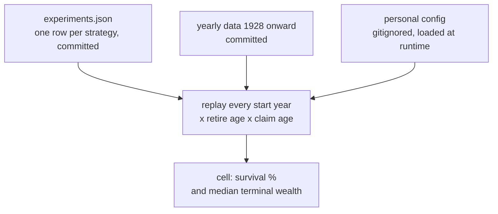
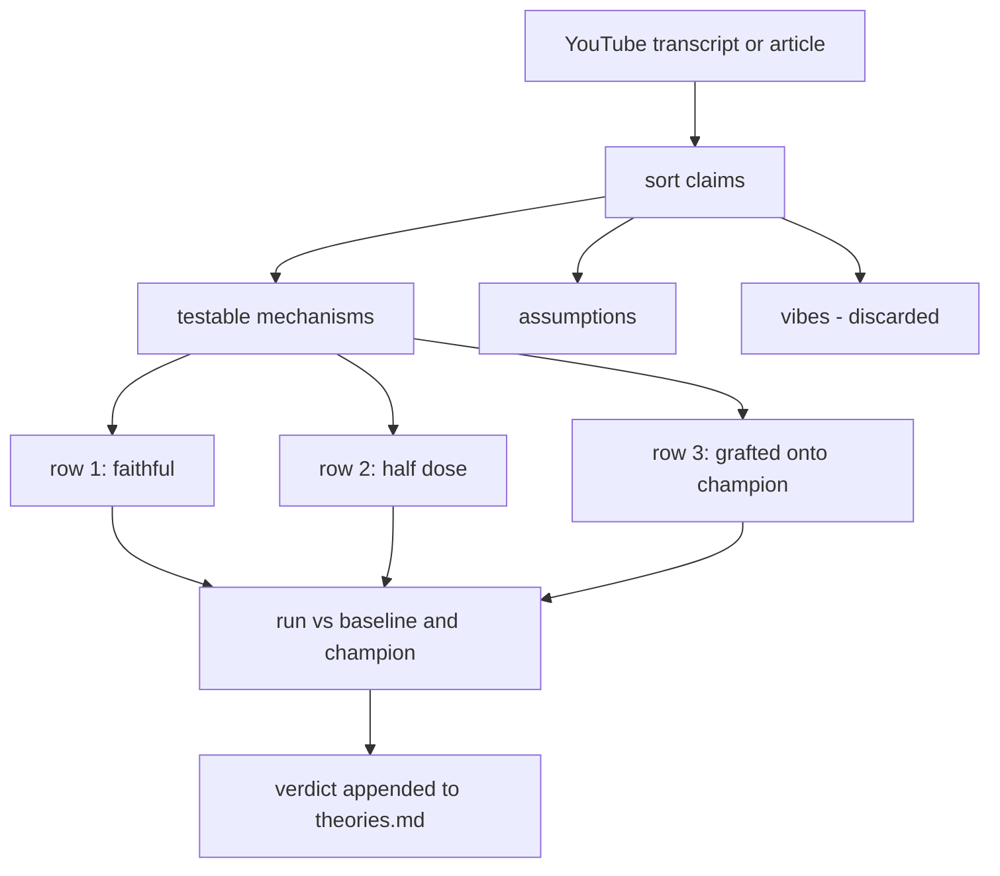

import Figure from "@/components/blog/Figure.astro";
import VizFigure from "@/components/blog/VizFigure.astro";
import GoldWindow from "./gold-window.svg";

Every year I sit down and answer one question: **what's the earliest age I can stop working without ever running out of money?** Instead of a spreadsheet, I have [retire-sim](https://github.com/jonborchardt/retire-sim), a small Monte Carlo simulator that's become something more interesting: a lab, with a lab protocol, and an AI lab assistant that follows it.


## Real history, not random dice

Most retirement calculators sample random returns each year. That quietly erases the thing that actually kills retirements: _sequence-of-returns risk_, bad years arriving in the wrong order, right when you start withdrawing.

retire-sim instead replays **every actual historical start year since 1928** (Damodaran's yearly dataset: inflation plus seven asset classes: S&P 500, small caps, T-bills, Treasuries, corporate bonds, home prices, gold). Retiring "into 1966" is one complete run, lived year by year in the order it really happened. ~98 start years, ~98 runs, exhaustively, not a random sample. Bad decades stay bad decades.

## A goal most tools don't have: never hit zero

I'm not maximizing terminal wealth. The objective is:

> **Minimize retirement age, subject to: wealth stays above zero in ≥85% of historical sequences.**

Terminal wealth is explicitly _sacrificial_: dying with a giant pile means I worked years I didn't need to. The sim even has an "enough" ratchet: once wealth crosses a multiple of annual spending, permanently de-risk and stop trying to get richer. Everything is graded on one axis: how early can I safely go?

## Experiments are just JSON

Every strategy idea, an allocation, a glide path anchored to years-from-retirement, an "enough" threshold, a spending guardrail, is a small labeled JSON entry:

```json
{
  "id": "bond-tent",
  "label": "bond tent",
  "allocationSteps": [
    { "yearsFromRetirement": -5, "allocation": { "stock": 0.4, "bond": 0.5, "tbill": 0.1 } },
    { "yearsFromRetirement": 5, "allocation": { "stock": 0.7, "bond": 0.3 } }
  ]
}
```

Add a row, and it automatically runs against every historical start year at every candidate retirement age and Social Security claim age, side by side with everything else. The experiment definitions are committed and contain no personal numbers; my actual finances live in a gitignored, encrypted-backup config that's loaded at runtime and never touches the build. Anyone can clone the repo and run the same experiments on a synthetic median-US-household dataset.

The two inputs stay separate all the way through; only the run joins them:




## What twenty-one rounds of experiments found

The single most useful move was diagnosing the **failure mode** before picking strategies. Which historical start years fail? For my plan it was the **1966–79 inflation cohorts**, not market crashes. That one fact predicted everything:

- Every de-risking strategy (permanent 40/60, bond tents) _lost_. Nominal bonds die in exactly the years that were killing me.
- Spending guardrails helped, but only honest ones: a "guardrail" tuned to trigger immediately is just a permanent budget cut wearing a costume.
- The "enough" ratchet was free (same survival, way less pointless terminal wealth), but only when buffered; set the threshold too low and paths latch into a mix that can't carry the remaining decades.
- The final winning shape moved my earliest acceptable-risk retirement age about **two years earlier** than the static baseline.

## Fuck. Gold. Really?

I did not want this result. But the failing cohorts were inflation cohorts, and the asset that rescues those is gold. To be clear, that means gold exposure through an ETF or fund tracking the metal's price, not bars in a safe. A windowed allocation from ~5 years before retirement through ~10 years after, roughly a fifth of the portfolio, then tapered away. Better survival _and_ better medians than the stock/bond baseline. The dose-response curve has a clean single peak; more gold surrenders the good sequences, gold held during accumulation is dead weight.

<Figure caption="The shape of the winning gold hedge, schematically: nothing during accumulation, about a fifth of the portfolio from five years before retirement to ten years after, then tapered away.">
  <VizFigure
    name="Gold allocation window against years from retirement"
    summary="A flat zero share through accumulation steps up to roughly 20% of the portfolio five years before retirement, holds there through the first ten retirement years, and slopes back to zero by about fifteen years after. Illustrative shape, not the exact tested numbers."
  >
    <GoldWindow class="h-auto w-full max-w-2xl" />
  </VizFigure>
</Figure>

The bigger lesson: **diversification is not the edge, cohort-matching is.** An "own every asset class" basket beat the two-asset baseline but lost badly to the targeted hedge, because it omitted the one asset that cures the specific years that break _this_ plan. And the sim keeps you honest in the other direction too: a bottom-decile micro-cap tilt dominated everything on paper, until we noticed its edge came from 1930s data with unbuyable spreads. Backtests you can't actually purchase don't count.

## The theory-test skill: YouTube gurus, meet the simulator

This is my favorite part. I gave Claude Code a skill called **theory-test**: paste in a retirement-advice YouTube transcript or article, and instead of an opinion, it produces an _empirical verdict from my own simulator_. It sorts the claims into testable mechanisms vs. assumptions vs. vibes, then builds three experiment rows: the advice **faithfully**, at **half dose**, and **grafted onto my reigning champion**. That last one answers the question I actually care about: _does this add anything I don't already have?_



The verdicts live in a running scoreboard ([theories.md](https://github.com/jonborchardt/retire-sim/blob/main/theories.md)). So far: the bucket strategy lost outright, "own everything + guardrails" lost to the targeted hedge, and the tax-coordination videos were the first outside advice to genuinely beat the champion, which promoted tax modeling to next year's top priority. The later rounds kept the pattern: rising-equity glidepaths were right about the shape and wrong about the asset (my champion _is_ that ravine, filled with gold instead of bonds), the Golden Butterfly won every historic crisis while failing the ordinary futures, VPW's "you can't run out" turned out to be spending collapse relabeled, and even the academic case _against_ gold survived only as a caveat, not a verdict. By the end, one theory was adjudicated entirely from rows already run, which is what happens when new advice keeps decomposing into experiments already done. The full set of verdicts is its own post: [the simulator watches retirement YouTube](/simulator-watches-retirement-youtube/).

| Date    | Source                                                                                                          | Claim                                                                                                                                                 | Result                                                                                                                                                                                                                                                                                                                                                                                                       |
| ------- | --------------------------------------------------------------------------------------------------------------- | ----------------------------------------------------------------------------------------------------------------------------------------------------- | ------------------------------------------------------------------------------------------------------------------------------------------------------------------------------------------------------------------------------------------------------------------------------------------------------------------------------------------------------------------------------------------------------------ |
| 2026-08 | [How to Retire Early at 50 With $2M (And Safely Spend $120K/Year)](https://www.youtube.com/watch?v=y62H0GFWLqM) | A cash/bond bucket covering the first retirement years protects against sequence-of-returns risk, letting equities recover before you sell them.       | Lost to both baseline and champion. The cash bucket kept the inflation-cohort failures (cash/bonds are what dies there) and added new insufficient-growth failures; even a bucket+gold hybrid lost. Sequence protection here came from an uncorrelated growth-adjacent hedge, not de-risking.                                                                                                                |
| 2026-08 | [How To Retire At Age 50 (EXPLAINED in 5 Minutes)](https://www.youtube.com/watch?v=X7pGnVryx3k)                 | Own every asset class and add spending guardrails, and a ~5.2–5.5% withdrawal rate is safe (Root Financial).                                          | Beat the two-asset baseline but lost to the targeted champion. The broad basket rescued crash-era and dot-com cohorts yet omitted the one asset (gold) that cures the dominant inflation cohorts, and equity dilution added growth-starvation failures; swapping half the gold hedge for real estate at identical dose re-broke saved cohorts. "Any uncorrelated asset" is false.                          |
| …       | 19 more                                                                                                         |                                                                                                                                                       |                                                                                                                                                                                                                                                                                                                                                                                                              |

## The experiment-round skill: a lab protocol the AI follows

The second skill, **experiment-round**, encodes the whole research loop: validate the config, run headlessly, compare every row against both the baseline _and_ the reigning champion, journal verdicts into the dataset before anything changes, design the next round, then **stop and report**. It carries hard-won discipline as standing rules, like _resolution_: with ~98 sequences, one percentage point is one flipped cohort and run-to-run jitter is 1–2 points, so differences below the noise floor are ties, not findings. The one-round-then-pause rule exists because my mid-loop catches were worth more than any autonomous run.

```mermaid
stateDiagram-v2
  accTitle: One experiment round, from validation to the mandatory pause
  accDescr: The round validates the config, runs headlessly, compares every row against baseline and champion, journals verdicts into the dataset before anything changes, designs the next round, then stops and reports; the human reviews and only then starts the next round.
  [*] --> Validate
  Validate --> Run: config ok
  Run --> Compare: results grid
  Compare --> Journal: verdicts vs baseline and champion
  Journal --> Design: findings written next to the data
  Design --> Report: next round drafted
  Report --> [*]: stop, human reviews
  state "Validate config" as Validate
  state "Run headless" as Run
  state "Compare rows" as Compare
  state "Journal verdicts" as Journal
  state "Design next round" as Design
  state "Stop and report" as Report
```



The lab notebook lives _with the data_: each experiment id gets a hypothesis-before and finding-after note, finished experiments are archived rather than deleted, and cross-cutting lessons accumulate in a `_learnings` list. Next year starts from knowledge, not folklore.

## The yearly ritual

The whole thing is built to be picked up once a year: open the config tab (every field has "here's where to find this number" help text), refresh the real numbers, add last year's row to the history table, re-run, read the results. The question changes yearly: 2024's edition compared house prices; the house is now bought and its costs are just dated events in the timeline. The code is _expected_ to be reshaped every year, because the decision it serves changes.


## Takeaway

None of this tells you to buy gold. It tells you the method: find which historical regimes break _your_ plan, test remedies against those exact years, distrust anything your instruments can't reproduce, know your noise floor, and write down what you learned next to the data you learned it on. And it turns out that method is exactly the kind of thing you can teach an AI to run.
