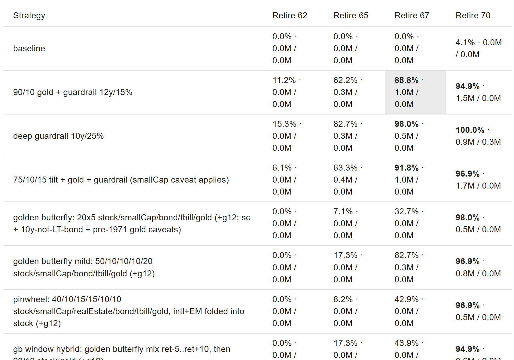
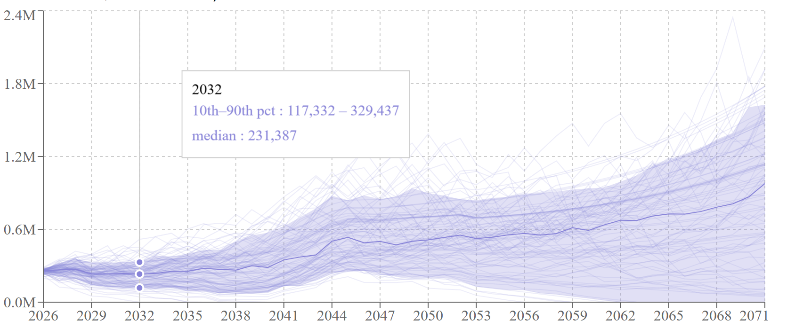
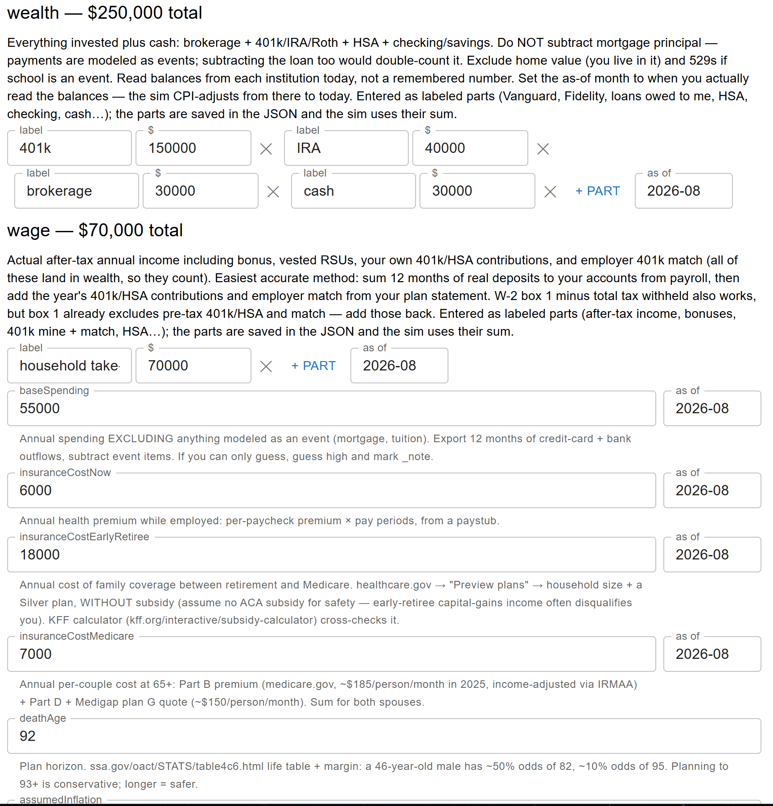

import Figure from "@/components/blog/Figure.astro";
import VizFigure from "@/components/blog/VizFigure.astro";
import GoldWindow from "./gold-window.svg";
import PiecesLadder from "./pieces-ladder.svg";
import ExperimentCellViz from "./experiment-cell-viz.svg";
import TheoryTestViz from "./theory-test-viz.svg";
import ExperimentRoundViz from "./experiment-round-viz.svg";

Every year I sit down and answer one question: **what's the earliest age I can stop working without ever running out of money?** Instead of a spreadsheet, I have retire-sim, a small deterministic historical-replay simulator that's become something more interesting: a lab, with a lab protocol, and an AI lab assistant that follows it. (The repo is private, so no link — the code described below is real, just not public.)

<Figure caption="An earlier season's results grid. The 'deep guardrail 10y/25%' row beating the honest guardrail is exactly the dishonest-guardrail trap described below — that row, the micro-cap tilt, and the golden-butterfly rows have since been deleted from the committed catalog (the bans are now enforced by the validator), so a fresh clone won't show those rows.">
  

</Figure>

## Real history, not random dice

Most retirement calculators sample random returns each year. That quietly erases the thing that actually kills retirements: _sequence-of-returns risk_, bad years arriving in the wrong order, right when you start withdrawing.

retire-sim instead replays **every actual historical start year since 1928** (Damodaran's yearly dataset: inflation plus seven asset classes: S&P 500, bottom-decile US stocks, T-bills, Treasuries, corporate bonds, home prices, gold, plus a silver column added later from a separate source). Retiring "into 1966" is one complete run, lived year by year in the order it really happened. 98 start years, 98 runs, exhaustively, not a random sample. Only the earlier half have a full lifetime of real data behind them: a run that outlives the dataset finishes on the dataset's own compound-growth year rather than wrapping around. Bad decades stay bad decades.

## A goal most tools don't have: never hit zero

I'm not maximizing terminal wealth. The objective is:

> **Minimize retirement age, subject to: wealth stays above zero in ≥85% of historical sequences.**

Terminal wealth is explicitly _sacrificial_: dying with a giant pile means I worked years I didn't need to. The sim even has an "enough" ratchet: once wealth crosses a multiple of annual spending, permanently de-risk and stop trying to get richer. Everything is graded on one axis: how early can I safely go?

## Experiments are just JSON

Every strategy idea, an allocation, a glide path anchored to years-from-retirement, an "enough" threshold, a spending guardrail, is a small labeled JSON entry:

```json
{
  "id": "bond-tent",
  "label": "bond tent",
  "allocationSteps": [
    { "yearsFromRetirement": -5, "allocation": { "stock": 0.4, "bond": 0.5, "tbill": 0.1 } },
    { "yearsFromRetirement": 5, "allocation": { "stock": 0.7, "bond": 0.3 } }
  ]
}
```

Add a row, and it automatically runs against every historical start year at every candidate retirement age and Social Security claim age, side by side with everything else. The experiment definitions are committed and contain no personal numbers; my actual finances live in a gitignored, encrypted-backup config that's loaded at runtime and never touches the build. Anyone can clone the repo and run the same experiments on a synthetic median-US-household dataset.

The two inputs stay separate all the way through; only the run joins them:

<VizFigure
  name="How a JSON experiment row becomes a scored cell"
  summary="Committed experiment rows and the committed 1928 to 2025 history feed a validation step together with the chosen dataset, either a gitignored personal config or a committed synthetic one. The validated inputs reach the simulator, which replays every start year at every retirement and claim age and writes survival percentage plus median and worst-case terminal wealth into one results cell per strategy and age."
>
  <ExperimentCellViz class="mx-auto h-auto w-full max-w-2xl" aria-hidden="true" />
</VizFigure>

<Figure caption="The wealth fan chart on the synthetic dataset. Screenshot from an earlier dataset revision with a longer horizon; the committed dataset has since shortened the horizon and added a two-person survivor model, so a fresh run ends in 2067.">
  

</Figure>

## What twenty-seven rounds of experiments found

The single most useful move was diagnosing the **failure mode** before picking strategies. Which historical start years fail? There were two. Below a certain age the binding constraint wasn't markets at all, it was front-loaded school bills, which no allocation change fixes. Above it, the failing start years were the **1966–79 inflation cohorts**, not market crashes. That second fact predicted almost everything about which strategies worked:

- Every de-risking strategy (permanent 40/60, bond tents) _lost_. Nominal bonds die in exactly the years that were killing me.
- Spending guardrails helped, but only honest ones: a "guardrail" tuned to trigger immediately is just a permanent budget cut wearing a costume.
- The "enough" ratchet was free (same survival, way less pointless terminal wealth), but only when buffered; set the threshold too low and paths latch into a mix that can't carry the remaining decades.
- The final winning shape moved my earliest acceptable-risk retirement age about **two years earlier** than the static baseline.

What each piece buys, measured one at a time on the way to the final plan:

<Figure caption="The pieces ladder: what each decision adds, in success percentage across all 98 historical start years at the frontier retirement age. The spending guardrail is worth about 2 points, holding gold at all is worth 12, timing it into the window is worth another 8, and the enough ratchet is free. The taper alone clears the 85% bar — no piece is load-bearing for the frontier except the gold window itself.">
  <VizFigure
    name="Success rate gained by each piece of the plan"
    summary="A waterfall from a 76.5% baseline of 100% stock, up 2 points for the spending guardrail, 12 points for gold as a static asset, and 8 points for the window timing, ending at 99.0% for the full plan; the enough ratchet adds zero. A dashed line marks the 85% target and a marker shows the taper alone reaches 94.9%."
    data={{
      caption: "Success % gained by each piece, 98 start years at the frontier age",
      columns: ["Piece", "Effect"],
      rows: [
        ["baseline: 100% stock", "76.5%"],
        ["+ spending guardrail (12y / 15%)", "+2 pts"],
        ["+ gold as a static asset", "+12 pts"],
        ["+ window timing (22% from ret−6 to ret+9)", "+8 pts"],
        ["+ enough ratchet (40x)", "+0 (free)"],
        ["the plan", "99.0%"],
        ["taper alone, for reference", "94.9%"],
      ],
    }}
  >
    <PiecesLadder class="h-auto w-full max-w-2xl" />
  </VizFigure>
</Figure>

## Fuck. Gold. Really?

I did not want this result. But the failing cohorts were inflation cohorts, and the asset that rescues those is gold. To be clear, that means gold exposure through an ETF or fund tracking the metal's price, not bars in a safe. A windowed allocation from ~6 years before retirement through ~9 years after, a little over a fifth of the portfolio, then stepped back down to a permanent ~10%: never to zero. Better survival _and_ better medians than the stock/bond baseline. The dose-response curve peaks broadly between a fifth and a quarter; more gold surrenders the good sequences, gold held during accumulation is dead weight. And the versions that ended the hedge at zero re-broke the exact inflation cohorts the hedge exists for, which is why the window lands on a shelf instead of the floor.

<Figure caption="The shape of the winning gold hedge: nothing during accumulation, 22% of the portfolio from six years before retirement through the ninth year after, then a permanent 10%.">
  <VizFigure
    name="Gold allocation window against years from retirement"
    summary="A flat zero share through accumulation steps up to 22% of the portfolio six years before retirement, holds there through the ninth retirement year, then steps down to a permanent 10% hedge that is never removed. Drawn as a clean staircase; the dose and the anchors are the tested values."
  >
    <GoldWindow class="h-auto w-full max-w-2xl" />
  </VizFigure>
</Figure>

The obvious objection is that gold's backtest is a peg artifact: gold's market price was fixed at $35/oz before 1971, so the dataset has no meaningful gold history before then. That's what the silver column is for. Mirroring the plan with silver — which had a real market price through the years gold was pegged — reproduces the window's effect and even beats the gold plan at face value. But silver's frontier collapses under a −2%/yr return drag while gold's survives its own, so asymmetry of error keeps gold.

The bigger lesson: **diversification is not the edge, cohort-matching is.** An "own every asset class" basket beat the two-asset baseline but lost badly to the targeted hedge, because it omitted the one asset that cures the specific years that break _this_ plan. And the sim keeps you honest in the other direction too: a bottom-decile micro-cap tilt dominated everything on paper, until we noticed its edge came from pre-1981 data with unbuyable spreads and a size premium that faded the moment it was published. Backtests you can't actually purchase don't count.

## The theory-test skill: YouTube gurus, meet the simulator

This is my favorite part. I gave Claude Code a skill called **theory-test**: paste in a retirement-advice YouTube transcript or article, and instead of an opinion, it produces an _empirical verdict from my own simulator_. It sorts the claims into testable mechanisms, assumptions to fact-check against history, and framing that has to be mapped back to whatever real mechanism it's a proxy for. Then it usually builds three experiment rows: the advice **faithfully**, at a **milder dose**, and as a **hybrid grafted onto my reigning champion**. That last one answers the question I actually care about: _does this add anything I don't already have?_

<VizFigure
  name="The theory-test skill, from transcript to scoreboard"
  summary="A source URL is required and its captions are fetched. The transcript is sorted into testable mechanisms, assumptions fact-checked against history, and framing mapped to a real mechanism. The mechanisms become three experiment rows, faithful, milder dose and hybrid on the champion, which the simulator runs against every start year and compares with the baseline and champion. The failing start years are diagnosed by cohort, and the verdict fans out to the theories scoreboard, the journal and the scored sources list."
>
  <TheoryTestViz class="mx-auto h-auto w-full max-w-2xl" aria-hidden="true" />
</VizFigure>

The verdicts live in a running scoreboard (theories.md, in that same private repo). So far: the bucket strategy lost outright, "own everything + guardrails" lost to the targeted hedge, and the tax-coordination videos were the first outside advice to beat the champion at all, though only as a sensitivity bound, since a flat-rate engine can't verify the low effective rate is actually achievable, which is exactly why it promoted tax modeling to next year's top priority. The later rounds kept the pattern: rising-equity glidepaths were right about the shape and wrong about the asset (my champion _is_ that ravine, filled with gold instead of bonds), the Golden Butterfly won every historic crisis while failing the ordinary futures, VPW's "you can't run out" turned out to be spending collapse relabeled, and even the academic case _against_ gold survived only as a caveat, not a verdict. By the end, most new theories were adjudicated entirely from rows already run, which is what happens when new advice keeps decomposing into experiments already done. The full set of verdicts is its own post: [the simulator watches retirement YouTube](/simulator-watches-retirement-youtube/).

| Date    | Source                                                                                                          | Claim                                                                                                                                                 | Result                                                                                                                                                                                                                                                                                                                                                                                                       |
| ------- | --------------------------------------------------------------------------------------------------------------- | ----------------------------------------------------------------------------------------------------------------------------------------------------- | ------------------------------------------------------------------------------------------------------------------------------------------------------------------------------------------------------------------------------------------------------------------------------------------------------------------------------------------------------------------------------------------------------------ |
| 2026-08 | [How to Retire Early at 50 With $2M (And Safely Spend $120K/Year)](https://www.youtube.com/watch?v=y62H0GFWLqM) | A cash/bond bucket covering the first retirement years protects against sequence-of-returns risk, letting equities recover before you sell them.       | Lost to both baseline and champion. The cash bucket kept the inflation-cohort failures (cash/bonds are what dies there) and added new insufficient-growth failures; even a bucket+gold hybrid lost. Sequence protection here came from an uncorrelated growth-adjacent hedge, not de-risking.                                                                                                                |
| 2026-08 | [How To Retire At Age 50 (EXPLAINED in 5 Minutes)](https://www.youtube.com/watch?v=X7pGnVryx3k)                 | Own every asset class and add spending guardrails, and a ~5.2–5.5% withdrawal rate is safe (Root Financial).                                          | Beat the two-asset baseline but lost to the targeted champion. The broad basket rescued crash-era and dot-com cohorts yet omitted the one asset (gold) that cures the dominant inflation cohorts, and equity dilution added growth-starvation failures; swapping half the gold hedge for real estate at identical dose re-broke saved cohorts. "Any uncorrelated asset" is false.                          |
| …       | dozens more                                                                                                     |                                                                                                                                                       |                                                                                                                                                                                                                                                                                                                                                                                                              |

## The experiment-round skill: a lab protocol the AI follows

The second skill, **experiment-round**, encodes the whole research loop: validate the config, run headlessly, compare every row against both the baseline _and_ the reigning champion, journal verdicts into the dataset before anything changes, design the next round, then **stop and report**. It carries hard-won discipline as standing rules, like _resolution_: with 98 sequences, one percentage point is one flipped cohort, and re-stamping the as-of month or refreshing an input shifts results by 1–2 points, so differences below that noise floor are ties, not findings. The one-round-then-pause rule exists because my mid-loop catches were worth more than any autonomous run.

<VizFigure
  name="One experiment round, from validation to the mandatory pause"
  summary="The round preflights the config and stops outright if the check fails; otherwise it runs headlessly, compares every row against baseline and champion, journals verdicts into the dataset before anything changes, designs the next round, then stops and reports. The human reviews and only then starts the next round. When two consecutive rounds produce no row that beats the champion beyond the noise floor, the loop converges instead and writes the final summary."
>
  <ExperimentRoundViz class="mx-auto h-auto w-full max-w-2xl" aria-hidden="true" />
</VizFigure>

The lab notebook lives _with the data_: each experiment id gets a hypothesis-before and finding-after note, finished experiments are archived rather than deleted, and cross-cutting lessons accumulate in a `_learnings` list. Next year starts from knowledge, not folklore.

## The yearly ritual

The whole thing is built to be picked up once a year: open the config tab (every field has "here's where to find this number" help text), refresh the real numbers, add last year's row to the history table, re-run, read the results. The question changes yearly: 2024's edition compared house prices; the house is now bought and its costs are just dated events in the timeline. The code is _expected_ to be reshaped every year, because the decision it serves changes.



## Takeaway

None of this tells you to buy gold. It tells you the method: find which historical regimes break _your_ plan, test remedies against those exact years, distrust anything your instruments can't reproduce, know your noise floor, and write down what you learned next to the data you learned it on. In the final rounds even the sim's own flattering assumptions got that treatment: each caveat — ignored taxes, rich equity valuations, gold mean-reversion, the joint model — was made runnable (taxes as a heavier withdrawal-tax scenario, the rest as permanent return drags) and priced in working years, from about zero–one for gold reversion up to about two for ignored taxes, and the plan's edge over the baseline _widens_ under identical pessimism. The honest insurance against unmodeled tails turned out to be one more working year, not a different portfolio. And it turns out this whole method is exactly the kind of thing you can teach an AI to run.
