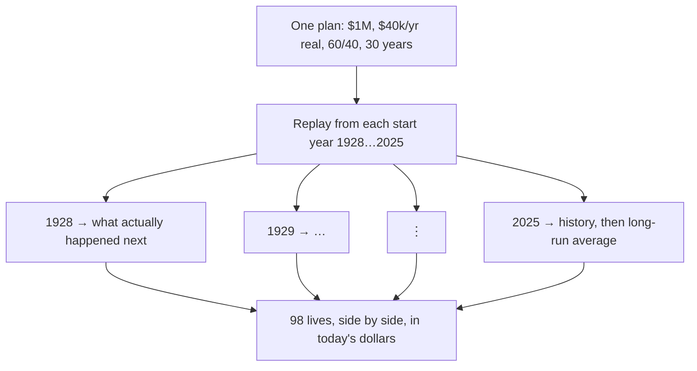

import Figure from "@/components/blog/Figure.astro";
import VizFigure from "@/components/blog/VizFigure.astro";
import FourLives from "./four-lives.svg";
import EndingBalances from "./ending-balances.svg";
import FailureBands from "./failure-bands.svg";

Here is a household. It has \$1,000,000. It retires at 65, spends \$40,000 a year — the textbook 4% — adjusted for inflation every year, holds a 60/40 stock/bond index portfolio, rebalances annually, and needs the money to last thirty years. No Social Security, no pension, no house, no kids, no taxes, no fees. The most boring retirement plan it is possible to write down.

Now run that exact household — same dollars, same spending, same portfolio, same rules — ninety-eight times, once for every year since 1928 it could have retired into, using what stocks, bonds and inflation actually did next. That's what [my simulator](/retirement-simulator-ai-lab/) does: instead of rolling random returns, it replays every historical start year in order, one full life each, and reports the results in today's dollars.

Four of those ninety-eight lives, all in today's dollars:

**Retire in 1929.** The worst possible timing, on paper: the market loses most of its value in the first three years, then the Depression, then a world war. And yet the first decade barely hurts — prices are _falling_, so the \$40k gets cheaper to fund every year and the bonds hold up; the portfolio is still at \$800k in 1934 and \$900k in 1939. The one real scare comes late, when the postwar inflation of the late 1940s bites and the balance sags to about \$520k around 1949. Then it recovers. This household dies in 1959 with **\$690,000** — a comfortable retirement that began in the single worst year of the century.

**Retire in 1966.** Nothing dramatic ever happens. Stocks go sideways for a decade and a half; inflation goes 3, 5, 6, 11, 9, 13 percent. Year by year the withdrawals get bigger in nominal terms and the portfolio doesn't. It's \$875k in 1971 — fine — then \$612k in 1976 — hm — then \$319k in 1981, and now the math is obvious to anyone who does it. The great bull market finally arrives in 1982 and it doesn't matter, because there's too little left to ride it: \$291k in 1986, \$156k in 1991, and the account hits zero in 1996, at age 94, in the last year of the plan. Two decades of watching it come.

**Retire in 1982.** Sixteen years after that household, and same everything. Inflation is finally breaking, and stocks and bonds both take off. It's \$1.6 million by 1987, \$2.2 million by 1992, \$3.5 million by 1997; the dot-com bust and 2008 are dents in a line going up. This household dies in 2012 with **\$5.8 million** — five times what it started with, after taking \$40k out every year for thirty years. It never had a worried moment.

**Retire in 2000.** The dot-com top; a decade of nothing follows. Down to \$815k by 2005, \$690k by 2010, and it feels like the 1966 story is starting again — but the inflation never shows up, so the withdrawals stay cheap, and the balance just goes flat: \$740k in 2015, \$870k in 2020, back down to about \$740k at the end. Never comfortable, never actually in danger. A retirement of low-grade unease that turns out fine.

<Figure caption="The four lives above on one chart: real portfolio balance by year of retirement. Dots are the balances stated in the text; the lines between them are straight, not the actual year-by-year path.">
  <VizFigure
    name="Real portfolio balance over thirty years for the 1929, 1966, 1982 and 2000 retirees"
    summary="All four start at $1M. The 1982 line climbs almost without pause to $5.8M. The 1929 and 2000 lines dip below $1M and stay roughly flat, ending at $690k and about $740k. The 1966 line declines steadily from year one and reaches zero in year thirty."
    data={{
      caption: "Real balance at stated checkpoints (today's dollars)",
      columns: ["Years in", "Retire 1929", "Retire 1966", "Retire 1982", "Retire 2000"],
      rows: [
        ["0", "$1,000k", "$1,000k", "$1,000k", "$1,000k"],
        ["5", "$800k", "$875k", "$1,600k", "$815k"],
        ["10", "$900k", "$612k", "$2,200k", "$690k"],
        ["15", "—", "$319k", "$3,500k", "$740k"],
        ["20", "≈$520k", "$291k", "—", "$870k"],
        ["25", "—", "$156k", "—", "—"],
        ["30", "$690k", "$0", "$5,800k", "≈$740k"],
      ],
    }}
  >
    <FourLives class="h-auto w-full max-w-2xl" />
  </VizFigure>
</Figure>

Across all ninety-eight: the median leaves \$1.7 million behind, the bottom tenth around \$350k, the top tenth \$3.7 million. Five run out — 1964 through 1968, all neighbors, all the 1966 story — and every one fails in the last five years of the thirty.

<Figure caption="Where the plan ends after thirty years, across all ninety-eight start years, with the four lives above marked.">
  <VizFigure
    name="Ending balances across all start years, with the four example retirees marked"
    summary="On a $0 to $6M scale the 10th-to-90th percentile band runs from about $350k to $3.7M with the median at $1.7M. The 1929 and 2000 retirees sit just below the median at $690k and about $740k; the 1982 retiree sits far to the right at $5.8M, beyond the top tenth; the 1966 retiree sits at zero, one of five failing start years, 1964 through 1968."
    data={{
      caption: "Ending balance after 30 years, today's dollars",
      columns: ["Marker", "Ending balance"],
      rows: [
        ["Failing start years (1964–68), 5 of 98", "$0"],
        ["Bottom tenth", "≈$350k"],
        ["Retire 1929", "$690k"],
        ["Retire 2000", "≈$740k"],
        ["Median", "$1.7M"],
        ["Top tenth", "$3.7M"],
        ["Retire 1982", "$5.8M"],
      ],
    }}
  >
    <EndingBalances class="h-auto w-full max-w-2xl" />
  </VizFigure>
</Figure>

The household did nothing differently in any of these. It didn't panic-sell, it didn't get greedy, it didn't skip a rebalance. The one input that varied was the year on the calendar when it stopped working, and that one input spanned the entire distance from ruin to a fortune.

## This is what "sequence risk" actually means

Every retirement calculator mentions sequence-of-returns risk. Most of them then model it as _volatility_ — random good and bad years — which quietly turns it into something averages can tame. That's not it. The point is that returns arrive in an _order_, you can't choose the order, and the order in the first decade of withdrawals matters more than the average over all thirty.

Look at the failures. The 1929 retiree — who ate a 90% stock crash across the first three years — is fine, because the crash came with _deflation_: \$40k of spending got cheaper, bonds held their real value, and the portfolio only had to survive a few terrible years before a long recovery. The 1966 retiree ate no crash at all. What they got instead was fourteen years of stocks going nowhere while inflation ran 5, 7, 11, 13 percent — so the "\$40k" they were withdrawing was \$100k in nominal terms by the end, from a portfolio that hadn't grown. There was no year in which anything dramatic happened. There was just a slow, unremarkable, unrecoverable grind, and by the time it stopped (1982 — the year the _luckiest_ retiree in the dataset was just getting started) the money that would have compounded through the greatest bull market in history had already been spent on groceries.

Two retirees, sixteen years apart, identical in every decision, one broke and one rich. Nothing either of them did in retirement could have swapped their outcomes. That's the risk. Not "markets go down." _Your retirement date is a lottery ticket and you draw it once._

## The uncomfortable corollaries

**Terminal wealth is mostly luck.** The 1982 retiree was not smarter than the 1966 retiree. If you die with a large pile, that is overwhelmingly a statement about your start year, not your skill — and it means you probably worked years you didn't need to. That's the argument for an "enough" ratchet in the plan: once the portfolio is far enough ahead of the plan, stop trying to get richer, because getting richer was never the goal and the top of the fan is unbuyable anyway.

**Ruin is mostly luck too — but which years ruin _you_ is not.** The textbook household fails in 1964–68. A more aggressive household (earlier retirement, higher spending) fails in a wider band around the same years plus a few others; a bond-heavier one fails the same inflation years harder. The identity of the killer cohorts is a property of _your_ plan, and it's discoverable — the simulator lists the failing start years for every plan it runs. Once you know your failure family, you know what you're actually insuring against, and it's very often not the thing the advice industry is selling insurance for. (Cash buckets and bond tents insure against 1929. That was never the problem.)

<Figure caption="Which start years ruin you is a property of your plan. The textbook household fails only 1964–68. Making it bond-heavier widens that same inflation band — it never adds a crash-era failure. Overspending widens the band and admits new failure families: the Depression era and the dot-com top.">
  <VizFigure
    name="Failing start years for three variants of the same plan"
    summary="Three rows on a shared 1928-to-2025 axis of retirement start years, failing years marked as filled blocks. The textbook 60/40 plan at 4% spending fails 1964 through 1968, five of 98. The bond-heavier 40/60 variant fails 1961 through 1968, eight of 98. The 5%-spending variant fails 1928, 1929, 1936, 1956, 1959 through 1973, 1999 and 2000 — twenty-one of 98."
    data={{
      caption: "Failing start years by plan variant (98 start years each)",
      columns: ["Plan variant", "Failing start years", "Count", "Success"],
      rows: [
        ["textbook: 60/40, 4% spending", "1964–68", "5 of 98", "94.9%"],
        ["bond-heavier: 40/60, 4% spending", "1961–68", "8 of 98", "91.8%"],
        ["higher spending: 60/40, 5%", "1928–29, 1936, 1956, 1959–73, 1999–2000", "21 of 98", "78.6%"],
      ],
    }}
  >
    <FailureBands class="h-auto w-full max-w-2xl" />
  </VizFigure>
</Figure>

**"Average return" is a number nobody experiences.** The average-return projection every planner uses is the mean across exactly this fan. It's a fine description of the 1943 retiree — the median line — and a lie for everyone else. The failing cohorts are precisely the ones where the average doesn't show up on time. A plan is not "does the average work"; it's "how many of the ninety-eight lines stay above zero," and the answer changes with every input you touch.

**Success rate is a count of years, not a probability.** 95% here means five start years out of ninety-eight, all adjacent, all the same story. That's the resolution of the instrument: one percentage point is one flipped cohort. Nobody should optimize a retirement plan to a decimal, and anyone reporting 94.6% vs 95.1% as a difference is reporting noise.

## What you can actually do about a lottery

You can't pick the ticket. You can change the fan.

Every experiment I've run on my own plan was, in retrospect, this: find the cohorts that break the plan, and shift the shape of the distribution so those lines stay above zero — even at the cost of the top of the fan, which was never spendable anyway. For my plan the failing family was the inflation cohorts, so the fix was an asset that holds real value through a decade of inflation, held only in the window around the retirement date where the sequence matters. It happened to raise the median too, but that's not why it won: it cut off the zero tail. That's the trade you want, even when it isn't free.

The other lever is spending flexibility, and it's real but smaller than the [many YouTube videos](/simulator-watches-retirement-youtube/) suggest: a livable guardrail — cut spending modestly when the portfolio falls behind — rescues a cohort or two at the edge of the failure family. What it can't do is rescue a plan whose allocation is wrong for its failure years; no depth of belt-tightening turns 1966 into 1982.

And the third is time: below the plateau where every start year survives, one more working year is worth a lot; above it, another year buys nothing. Knowing which side you're on is the whole game.

## The one chart

If you take one thing from this series, make it the fan chart: your plan, run once per historical start year, one line each. Not the average. Not a percentile band from random draws. The actual ninety-odd lives your plan would have lived, side by side, so you can see with your own eyes that the same choices land everywhere from zero to five times what you started with — and then ask, calmly, which of those lines you're willing to accept, and what would move the bottom ones.

---

_The textbook household above is synthetic — the point is the shape, not the dollars. The dataset ships with the simulator repo (`datasets/textbook-4pct.json`), so anyone can rerun this exact fan. Runs that outlive the historical dataset continue on the long-run average year, so the most recent cohorts are partly projection; the older ones are entirely history._
