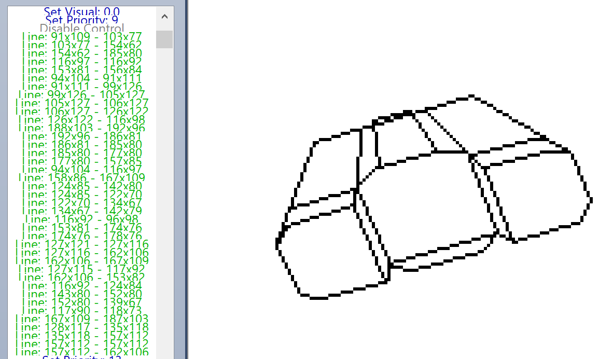
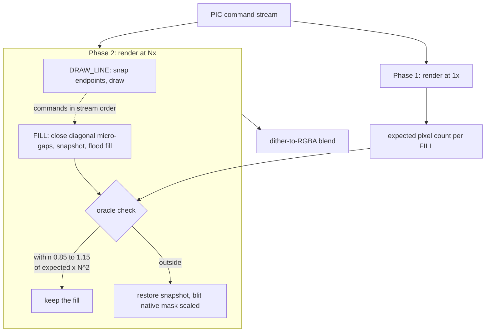
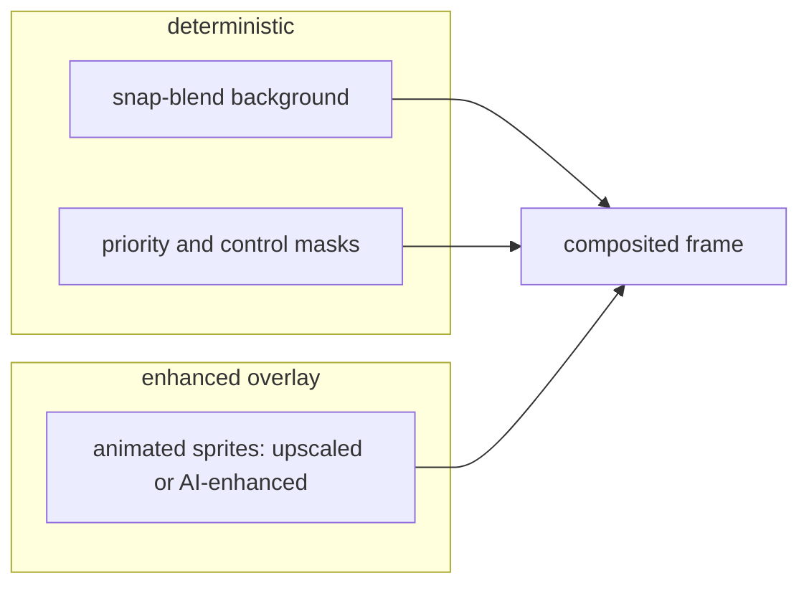
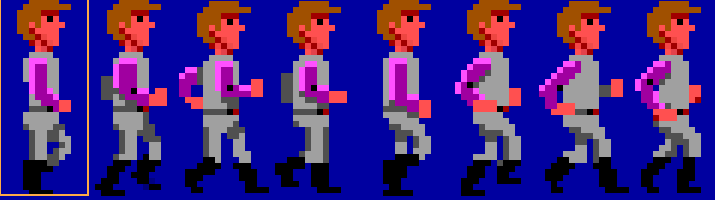
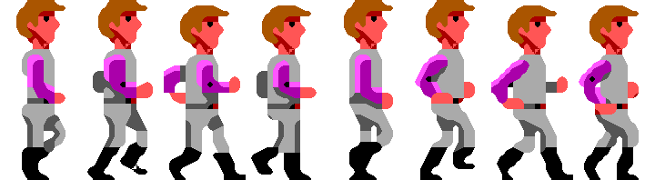
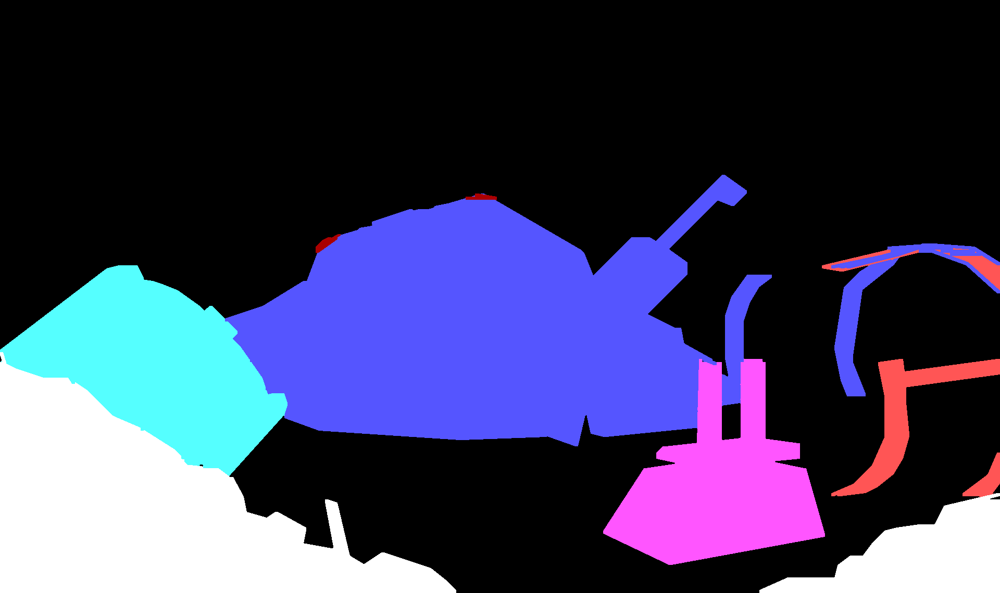
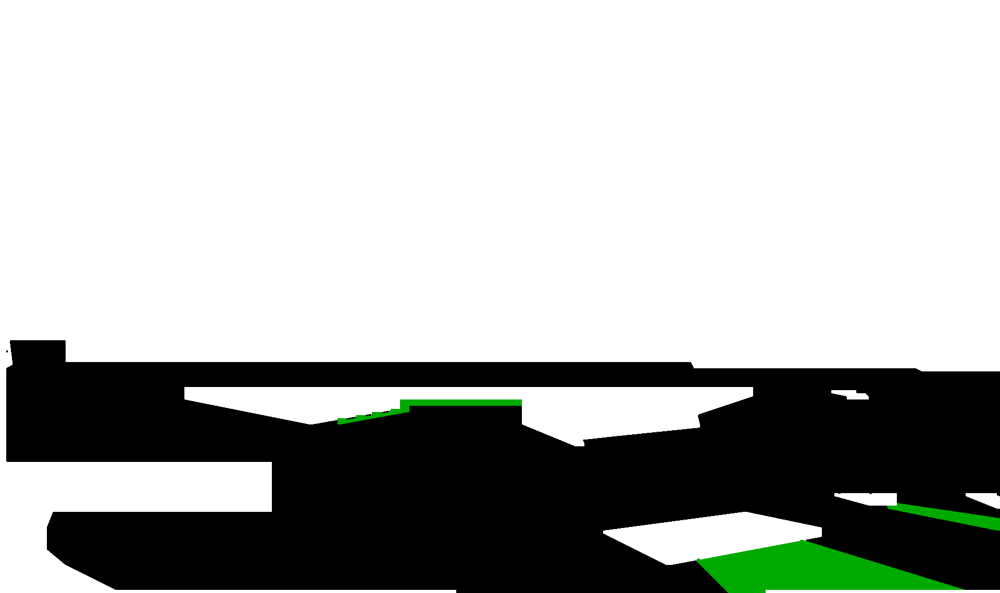
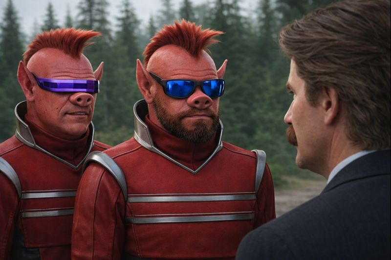

import Callout from "@/components/blog/Callout.astro";
import Figure from "@/components/blog/Figure.astro";
import VizFigure from "@/components/blog/VizFigure.astro";
import GapClosure from "./gap-closure.svg";
import DitherBlend from "./dither-blend.svg";
import sweepOriginalScale6x from "./sweep-original-vs-scale6x.svg";
import sweepScale6xSnap from "./sweep-scale6x-vs-snap-blend.svg";
import sweepNativeSnap from "./sweep-native-vs-snap-blend.svg";
import roomJunkPile from "./sweep-room-junk-pile.svg";
import roomTunnels from "./sweep-room-tunnels.svg";
import roomRobotHead from "./sweep-room-robot-head.svg";
import roomHangar from "./sweep-room-hangar.svg";
import roomScrapyard from "./sweep-room-scrapyard.svg";
import roomCockpit from "./sweep-room-cockpit.svg";
import roomAstroChicken from "./sweep-room-astro-chicken.svg";
import roomBurgerInterior from "./sweep-room-burger-interior.svg";
import roomBurgerExterior from "./sweep-room-burger-exterior.svg";
import roomDesert from "./sweep-room-desert.svg";
import sweepAi from "./sweep-original-vs-ai-upscale.svg";

Sierra On-Line's SCI0 engine draws backgrounds as vector commands — lines, patterns, and flood fills executed in sequence at 320x190. It works perfectly at native resolution. But render those same commands at 2x, 3x, or higher? Fills leak through hairline gaps that didn't exist at 320 pixels wide, and your pristine space bar becomes a watercolor disaster.

This is the problem **snap-blend** solves.

## The problem

SCI0 PICs aren't rasterized images — they're programs. A PIC resource is a stream of drawing commands: draw a line here, fill this region there. The fill commands depend on boundaries being watertight. At native resolution, the integer-coordinate Bresenham lines form perfect barriers.



Scale everything up and suddenly there are fractional-pixel gaps where fill ink escapes into neighboring regions, corrupting the image. Scaling can also fragment boundaries, causing fills to terminate early or leave holes.

A simplified PIC command stream looks something like this:

```plaintext
SET_VISUAL_COLOR 0x03        // dark cyan
// Diamond
DRAW_LINE (160, 40) → (240, 95)
DRAW_LINE (240, 95) → (160, 150)
DRAW_LINE (160, 150) → (80, 95)
DRAW_LINE (80, 95) → (160, 40)
// Line intended to bisect the Diamond
DRAW_LINE (120, 68) → (200, 123)
FILL (160, 95)               // flood fill stays bounded
```

At 320x190, the rasterized lines happen to touch cleanly, so the shape remains sealed and the fill stays inside.

Scale the same geometry to 960x570, however, and the independently rounded midpoint coordinates may no longer land exactly on the scaled diagonal edges. That can create a one-pixel gap at the junction, allowing the flood fill to escape and flood the entire canvas.


Existing solutions don't help. ScummVM and SCI Companion render at native res. Pixel-art upscalers (Scale2x, hqx, xBR) operate on finished rasters — they can't fix a fill that leaked during rendering. The problem has to be solved _inside_ the renderer.

Upscaling after rasterization preserves correctness, but introduces uneven line thickness and edge wobble.

<Figure caption="Original 320x190 render versus a Scale6x post-raster upscale of the same Space Quest 3 room; the sweep moves back and forth between the two.">
  
</Figure>

Snap-blend fixes this by altering the rendering directly.

<Figure caption="Scale6x versus snap-blend on the same room: straight, evenly weighted lines and the same regions.">
  
</Figure>

## The approach

**snap-blend** combines several techniques into a pipeline: a native-resolution pass first, then a scaled pass that the native result supervises fill by fill.



### 1. Endpoint snapping

Line endpoints are snapped to the nearest scaled grid intersection, keeping boundaries aligned with the pixel grid at the target resolution.

```plaintext
function snapEndpoint(x, y, scale):
    return (round(x * scale) / scale,
            round(y * scale) / scale)
```

### 2. Diagonal micro-gap closure

A morphological pass detects and closes single-pixel diagonal gaps that form at scaled line junctions. These are the most common leak source.

```plaintext
// scan for diagonal gaps in the boundary mask:
//   . X      X .
//   X .  or  . X
// if found, fill one pixel to close the gap
for each pixel (x, y) in boundaryMask:
    if isEmpty(x, y) AND isBoundary(x-1, y-1) AND isBoundary(x+1, y+1):
        boundaryMask[x, y] = FILLED
    if isEmpty(x, y) AND isBoundary(x+1, y-1) AND isBoundary(x-1, y+1):
        boundaryMask[x, y] = FILLED
```

The pass is a two-pixel test: an empty cell whose diagonal neighbours are both boundary gets filled, which is enough to seal the junction.

<Figure caption="One diagonal micro-gap before and after closure. Left, a flood fill leaks through the empty cell between two diagonal boundary pixels; right, that one cell is filled and the fill stays on its side.">
  <VizFigure
    name="Diagonal micro-gap closure on a 6 by 6 pixel grid"
    summary="Two grids with a diagonal boundary that has one missing pixel. In the left grid the flood fill has spread through the gap to both sides of the diagonal; in the right grid the gap pixel is filled and the fill covers only the region above the diagonal."
  >
    <GapClosure class="h-auto w-full max-w-xl" aria-hidden="true" />
  </VizFigure>
</Figure>

### 3. Native render oracle

The renderer first builds a native-resolution reference render and uses it to validate each scaled flood fill. Instead of predicting where scaling errors might occur, snap-blend renders once at native resolution and uses that output as ground truth.

```plaintext
// Phase 1: render at native res to build the oracle
nativeCanvas = render(picCommands, scale=1)
for each FILL command[i]:
    expected[i] = countPixelsFilled(nativeCanvas, command[i])

// Phase 2: render at target scale, supervised by the oracle
scaledCanvas = createCanvas(320 * scale, 190 * scale)
for each command in picCommands:
    if command is DRAW_LINE:
        drawSnappedLine(scaledCanvas, command, scale)
    if command is FILL:
        closeGaps(scaledCanvas)  // micro-gap closure pass
        snapshot = save(scaledCanvas)
        actual = floodFill(scaledCanvas, command.x * scale, command.y * scale)
        limit = expected[i] * scale * scale

        if actual > limit * 1.15:          // overshoot — leaked
            restore(scaledCanvas, snapshot)
            blitNativeMask(scaledCanvas, nativeCanvas, command, scale)
        else if actual < limit * 0.85:     // undershoot — partial fill
            restore(scaledCanvas, snapshot)
            blitNativeMask(scaledCanvas, nativeCanvas, command, scale)
```

If a fill at 3x overshoots its expected area (scaled appropriately), it's a leak. The native render acts as an oracle supervising the upscaled render.

### 4. Native-mask fallback

When a fill is flagged as leaked and can't be salvaged, the corresponding region from the native render is nearest-neighbor-scaled and composited in. Correctness is preserved at the cost of sharpness in that region — but in practice, fallback fires rarely.

```plaintext
function blitNativeMask(scaledCanvas, nativeCanvas, fillCmd, scale):
    // find the filled region in the native render
    mask = extractFillRegion(nativeCanvas, fillCmd)
    // nearest-neighbor upscale the mask
    upscaled = nearestNeighborScale(mask, scale)
    // composite into the scaled canvas
    composite(scaledCanvas, upscaled, fillCmd.color)
```

### 5. Dither-to-RGBA blending

A cosmetic post-process. SCI0 uses dithered patterns to simulate colors beyond the 16-color EGA palette. The blend pass resolves these into smooth RGBA values for the browser renderer.

```plaintext
// SCI0 dither: alternating pixels of two EGA colors in a checkerboard
// e.g. color 0x03 (cyan) + color 0x0B (light cyan) = dither pair
//
//   C L C L        blended:
//   L C L C   →    all pixels become avg(cyan, lightCyan)
//   C L C L        = smooth teal in RGBA
//   L C L C

for each 2x2 block in output:
    colors = unique EGA colors in block
    if len(colors) == 2 AND isDitherPattern(block):
        rgba = blend(egaToRGB(colors[0]), egaToRGB(colors[1]))
        fill block with rgba
```

<Figure caption="The blend pass in one block: a 2x2 checkerboard of two EGA palette entries becomes four pixels of their average colour. Region shapes are untouched.">
  <VizFigure
    name="Dither checkerboard blended to a single RGBA colour"
    summary="Left, a 4 by 4 pixel checkerboard alternating two colours, with one 2 by 2 block outlined; right, a solid square of the average of the two colours. The output keeps the same footprint and loses only the checkerboard."
  >
    <DitherBlend class="h-auto w-full max-w-xl" aria-hidden="true" />
  </VizFigure>
</Figure>

This produces output that looks cleaner on modern displays without altering the underlying data.

## What's novel

None of the individual techniques are new. The interesting part is combining them into a supervised rendering pipeline where the native render validates the scaled one.

I haven't seen this approach used in retro vector renderers before. The problem domain is niche, but the pattern generalizes. Any format where vector drawing commands produce resolution-dependent fill boundaries could benefit: [AGI-era Sierra games](/agi-up-as-a-reference-renderer/), LucasArts SCUMM backgrounds, or other retro engines with interleaved draw/fill command streams.

## Results

Across tested rooms, snap-blend produced zero leaked fills while preserving native region boundaries at 3x scale. The blend pass is purely cosmetic — same correctness, nicer pixels.

It's the production strategy for [SCI.js](https://github.com/32bitkid/sci.js), a TypeScript reimplementation of the SCI0 engine focused on making Space Quest 3 playable in the browser with upscaled visuals.

Each comparison below sweeps between the two renders of one Space Quest 3 room; the labels in the bottom corners say which is which.

<Figure caption="Native 320x190 render versus snap-blend at 6x: identical regions, cleaner lines.">
  
</Figure>

<Figure caption="Original versus snap-blend: junk pile with a magenta hull section and cyan arch.">
  
</Figure>

<Figure caption="Original versus snap-blend: sewer tunnels under a blue-lit ceiling.">
  
</Figure>

<Figure caption="Original versus snap-blend: giant robot head among the wreckage.">
  
</Figure>

<Figure caption="Original versus snap-blend: ship in a blue hangar bay.">
  
</Figure>

<Figure caption="Original versus snap-blend: scrapyard with a wrecked pod and yellow tubes.">
  
</Figure>

<Figure caption="Original versus snap-blend: ship cockpit interior.">
  
</Figure>

<Figure caption="Original versus snap-blend: the Astro Chicken arcade cabinet.">
  
</Figure>

<Figure caption="Original versus snap-blend: inside Monolith Burger.">
  
</Figure>

<Figure caption="Original versus snap-blend: Monolith Burger from outside.">
  
</Figure>

<Figure caption="Original versus snap-blend: magenta desert dunes.">
  
</Figure>

## Upscaled animation overlays

One practical extension is compositing higher-resolution animated elements on top of snap-blend backgrounds.

Because snap-blend produces clean, stable regions, it acts as a reliable base layer. Animated sprites or effects, whether traditionally upscaled or AI-enhanced, can be overlaid without exposing the kinds of boundary artifacts that plagued the original pipeline.

In motion, the eye is far more forgiving. Minor inconsistencies in sprite detail are less noticeable than structural errors in the background. As long as the underlying regions are correct, the combined result reads as coherent.

This also sidesteps one of the hardest problems in AI upscaling: maintaining consistency across frames. By limiting enhancement to overlays and keeping the background deterministic, you avoid compounding temporal artifacts.

The frame is a stack: the deterministic background and its masks stay exact, and only the overlay layer is free to be enhanced.







## The future

Once the renderer became structurally reliable, the next question was how far visual enhancement could go without breaking correctness.

AI upscaling looks like an obvious shortcut. Take the original 320x190 output, run it through a modern image model, and get something that looks like a painted remake.

<Figure caption="Original render versus an AI-upscaled painting of the same hangar room.">
  
</Figure>

That works for screenshots. It breaks down for a renderer.

SCI0 backgrounds are not just images, they are structured scenes with implicit gameplay constraints. Walkable areas, object boundaries, and interaction zones all depend on the exact shape of regions.

Different colors tell the engine if the avatar should be seen in front or behind them.



Non white areas are walkable by the avatar, while non black areas will trigger event when walked over.



AI upscaling works well for screenshots, but renderers require deterministic structural correctness. Walk masks, occlusion boundaries, and interaction zones depend on exact regions. Because generative models can shift those boundaries unpredictably, AI is better treated as a constrained enhancement layer on top of a deterministic renderer.



## The road here

This was strategy v5 out of ten attempts. Strategies v1 through v4 each solved part of the problem — better line expansion, smarter gap detection — but none handled the full space of edge cases. The native render oracle was the breakthrough: instead of trying to predict where gaps would form, just render at native res first and let the result tell you what's correct. v6 through v10 explored alternatives but didn't improve on v5's approach. Two of those detours have their own write-ups: [borrowing agi-up as a reference renderer](/agi-up-as-a-reference-renderer/) and [the anchor-graph upscaler](/omyac-upscaler-anchor-graph/).

Sometimes the best algorithm is "do it twice (or ten times) and compare."

<Callout variant="note">
  All original background assets are the property of [Sierra On-Line](https://www.sierragames.com/). Their exact copyright status varies by title and jurisdiction, and this project does not attempt to reinterpret or redistribute those assets beyond rendering them in a different form. If you are interested in these games, the right move is to support the original creators and rights holders wherever those titles are available today.
</Callout>
