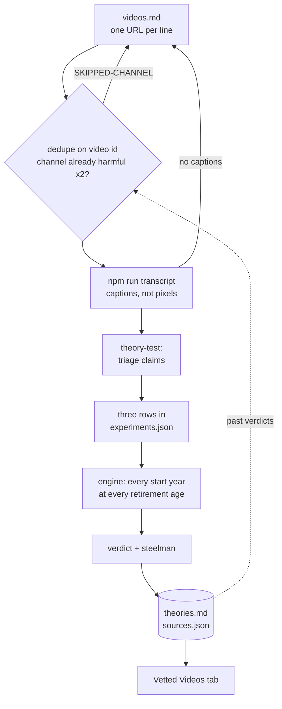
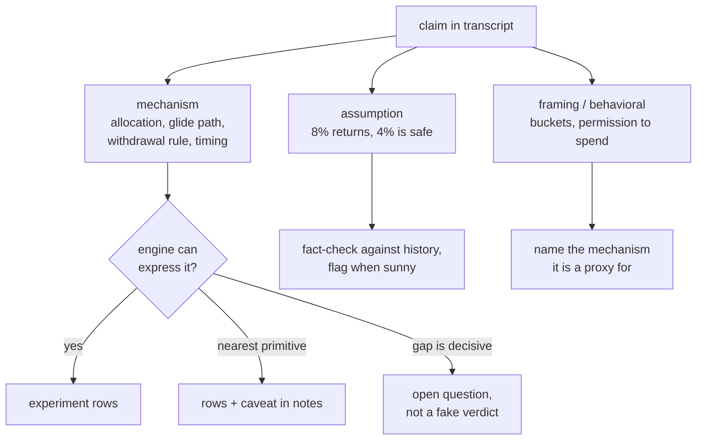

import Figure from "@/components/blog/Figure.astro";
import VizFigure from "@/components/blog/VizFigure.astro";
import VerdictSets from "./verdict-set-arithmetic.svg";

Here's the problem. YouTube knows I'm interested in finances and retirement, so it feeds me a twenty-minute video every day: "If You're 55 With $2.5M, Watch This BEFORE You Retire." Some of them are genuinely good. Some are confidently wrong in ways that would cost years. And there is no way to tell which from the thumbnail — the production quality of the good ones and the bad ones is identical, and they all say "sequence-of-returns risk" in the first ninety seconds.

I used to watch them. Now I paste the URL into a text file in [my simulator](/retirement-simulator-ai-lab/) and walk away. Dozens of videos later, I've watched none of them, and I know more about what's in them than I would have if I had.

The whole thing is a short pipeline from a text file to a scoreboard, and the scoreboard feeds back into the front of the queue:

## The queue is a text file

`videos.md` is one YouTube URL per line. That's the whole interface. When there are a few, I tell Claude Code "run the queue" and a skill called **theory-queue** takes over: it works down the file, runs each pending URL through the full pipeline, and appends `DONE` to the line the moment its verdict lands — not in a batch at the end, so an interrupted session loses nothing.

Two cheap checks happen before any real work. It dedupes on the 11-character video id (I paste the same video twice more often than I'd like to admit). And it fetches just the transcript header to get the channel name and looks it up in the scoreboard: if that channel already has two videos rated _harmful_, the queue marks the line `SKIPPED-CHANNEL` and moves on. One bad video is never enough to skip a channel — everyone has an off day. The second one earns it.

## Captions, not video

Nothing in the pipeline looks at pixels. A tiny script (`npm run transcript -- <url>`) pulls the video's captions the way the YouTube app itself does and prints a header — title, channel, URL — followed by the plain transcript. Auto-generated captions are fine; the claims survive the typos. If a video has no captions at all, it gets marked `NO-CAPTIONS` and I can paste a transcript by hand later, which so far has been never.

That's the entire "watching" step. Twenty minutes of talking head becomes about four thousand words of text in a couple of seconds.

## Triage: mechanism, assumption, or vibes

This is where the **theory-test** skill starts, and it's the part I care about most, because it's the part I was worst at when I watched the videos myself. Every claim in the transcript gets sorted into one of three piles, and the analysis names the piles explicitly:

1. **Mechanism claims** — an allocation, a glide path, a withdrawal rule, a timing window. These map onto things the engine can actually express, so they get _tested_.

2. **Assumption claims** — "8% returns," "4% is safe," a particular inflation number. These get fact-checked against history and flagged when sunny, but nobody builds an experiment for them, because replaying every real start year already supersedes any point assumption.

3. **Framing and behavioral content** — mental accounting, "permission to spend," discipline aids. Not testable. The skill's job is to say what real mechanism, if any, the framing is a proxy for. (The bucket strategy is the canonical example: it's a rising-equity glide path plus withdrawal discipline, and both halves already have names in the engine.)

Only the first pile reaches the engine; the other two still get an answer, just not an experiment:

The rule that keeps this honest is _translate faithfully or say you can't_. If a video's load-bearing rule is something the engine can't express — "refill the cash bucket only after up years" — the skill approximates with the nearest primitive and writes that caveat into the notes. It is forbidden from quietly adding engine features to flatter a video. And if the gap is plausibly decisive, the output is "open question," not a fake verdict. One theory this month — an options-overlay idea — was adjudicated as _honestly untestable_: the return series that would be needed doesn't exist for the failure cohorts. Pinning down exactly what data would be needed and verifying it isn't there is still an adjudication.

## Three rows, one of which matters

For anything testable, three experiment rows go into the committed `experiments.json`, alongside the untouched baseline and the reigning champion:

- **Faithful** — the video's own numbers, translated. Answers "is the video right?"

- **Half dose** — same idea, half strength. Dose-response separates _wrong idea_ from _right idea, wrong dose_.

- **Hybrid** — the video's distinctive mechanism grafted onto my current best plan. This is the load-bearing row, because it answers the only question I actually have: **does this add anything I don't already have?**

Then the normal experiment machinery runs: every row against every historical start year at every candidate retirement age. Same resolution discipline as everything else in the lab — one percentage point of success is one flipped cohort, under two points is a tie, not a finding.

## The verdict is set arithmetic

The report always leads with one line — _beat the champion / beat baseline only / lost to both_ — but the evidence underneath is a list of years. The engine emits which historical start years failed for each row, and the diagnosis is set arithmetic: which cohort families did the video's idea rescue, which did it re-break, and do those families match the video's own story about what it protects against?

That last question is the tell. The cash-bucket video's story was "protects you from selling stocks in a crash." What the numbers said was: it kept every one of the extended-inflation failures _and_ added a family of slow-growth failures, because the "safe" asset was the casualty. The idea failed on its own terms, and you can point at the years.

<Figure caption="The cash-bucket verdict as sets of failed start years. Tile counts are schematic; the shape is what the report shows.">
  <VizFigure
    name="Failed start years for the baseline versus the cash-bucket row, by cohort family"
    summary="The baseline fails only in the extended-inflation cohort family. The cash-bucket row keeps every one of those failures and adds a new family of slow-growth failures, while the crash-year cohorts the video claims to protect already survived under the baseline, so nothing was rescued."
  >
    <VerdictSets class="h-auto w-full max-w-2xl" />
  </VizFigure>
</Figure>

The last section of every report is the steelman: what did the source get _right_? Even a losing video usually names a real risk or a discipline worth keeping, and I want that residue on record rather than "video bad, next."

## Where it all lands

- `theories.md` — one row per video: source, one-line testable claim, one-line verdict. The public scoreboard.

- `sources.json` — one entry per video: id, channel, host, a score from −1 to 2, plus `right` and `wrong` claim _tags_ using shared wording — "spending guardrails," "bonds as the sequence-risk hedge" — so channels can be compared per topic. A rollup script aggregates it into a per-channel table: mean score, video count, unioned tags.

- **The Vetted Videos tab** in the app itself, which renders that rollup — a calibre table by channel and a per-video list — plus a hand-curated _insights_ block at the top: things that were right but nobody says, things everybody says that are wrong, the most-repeated claims, channels worth more of, engine gaps the videos surfaced.

The score is a four-point scale keyed to what the three rows did:

| Score | Label   | What it means                                                       |
| ----: | ------- | ------------------------------------------------------------------- |
|    −1 | harmful | the faithful version lost to a plain baseline                       |
|     0 | mixed   | mixed result, or untestable                                         |
|     1 | useful  | beat baseline, or right mechanism at the wrong dose                 |
|     2 | correct | beat the champion, or confirmed something the champion already does |

The channel-skip rule reads from the same file it writes to. The system's own past verdicts decide what it bothers to test next.

## What dozens of videos actually said

The distribution surprised me: two were _correct_ (beat or confirmed the champion), fifteen _useful_, eight _mixed_, six _harmful_ — six videos whose advice, taken faithfully, would have made a plain two-asset baseline _worse_. Not one was gibberish; the harmful ones were the polished ones recommending a big bond or cash sleeve as sequence-risk protection, which for a plan whose failure cohorts are the inflation years is exactly backwards.

The most-repeated mechanism across all of them — spending guardrails — turned out to be real, already in my plan, and worth about a couple of points. The thing that mattered most for me — _which asset fills the retirement window_ — is said by essentially nobody. The one outside idea that genuinely beat the champion (tax coordination in the pre-RMD window) came from the CFP videos.

And the pattern I did not expect: the first ten or so videos each added experiment rows. Of the last twenty, one needed a real re-run. The rest were adjudicated from rows that had already been run — new mainstream advice now decomposes into experiments already done. The queue stopped being a discovery engine and became a filter, which is what "converged" looks like from the outside.

## The one I'd have watched

The most recent video through the pipeline was Rob Berger's [_Can the Bucket Strategy Eliminate Sequence of Returns Risk?_](https://www.youtube.com/watch?v=gVYThVn5gQA) — a channel I actually like, and a topic where he's arguing against the room. It's a good example of why I'm glad I didn't just watch it: I would have nodded along with all of it.

The pipeline agreed with most of it. Buckets vs. plain rebalancing is settled in his favor — every bucket row lost to a rebalanced baseline, keeping the inflation-cohort failures (his own worked example, the 1966 retiree, is the head of that family) and adding growth-starvation ones. His withdrawal-policy content matched the guardrail and variable-withdrawal verdicts already on the board. His "one cash bucket if it helps you sleep" concession matched the measured drag numbers.

But it disagreed on the ranking, and that's the part I'd have absorbed uncritically. His thesis is that nothing eliminates sequence risk and the _withdrawal policy_ is the primary lever. In my tables the withdrawal policy was the secondary lever: the asset filling the retirement window moved the earliest safe retirement age two years, the honest guardrail moved it a couple of points, and no depth of spending flexibility rescued a cohort-mismatched allocation. "Nothing eliminates it, spending policy manages it" is right in general and understates how much cohort-matched allocation cuts it. Score: 1, useful; tags on both sides.

## What it can't do

It reads captions, so a video that makes its argument in a chart it never describes aloud gets under-read. It can only test what the engine can express — flat taxes, no account location, no convex payoffs — and the discipline of _saying so_ is doing a lot of load. And it grades everything against one household's failure cohorts; a channel that's "harmful" for an inflation-fragile early retiree might be fine advice for a sixty-eight-year-old with a pension. The scores are mine, not universal. But the system could be adapted to anyone's data.

## Takeaway

The trick isn't the AI reading transcripts — that's the easy part. It's that there was already a simulator with a stated objective, a reigning champion, a noise floor, and a habit of writing verdicts next to the data. Given that, "vet this video" reduces to "translate it into three rows and run them," and the vetting compounds: every verdict makes the next one cheaper, and the scoreboard eventually starts telling you which channels to stop feeding it. I get the residue — one line of claim, one line of verdict, and what to keep.
