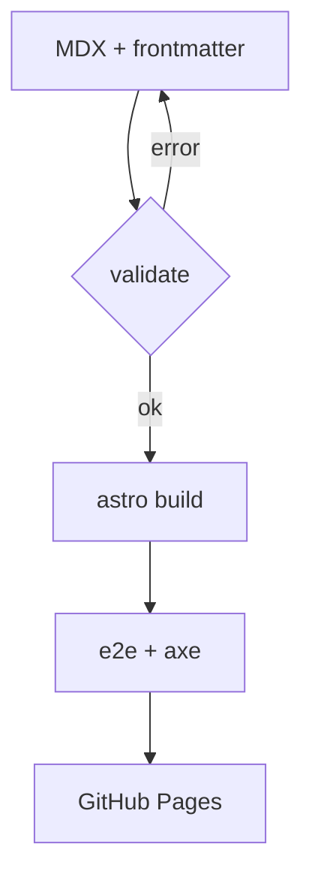
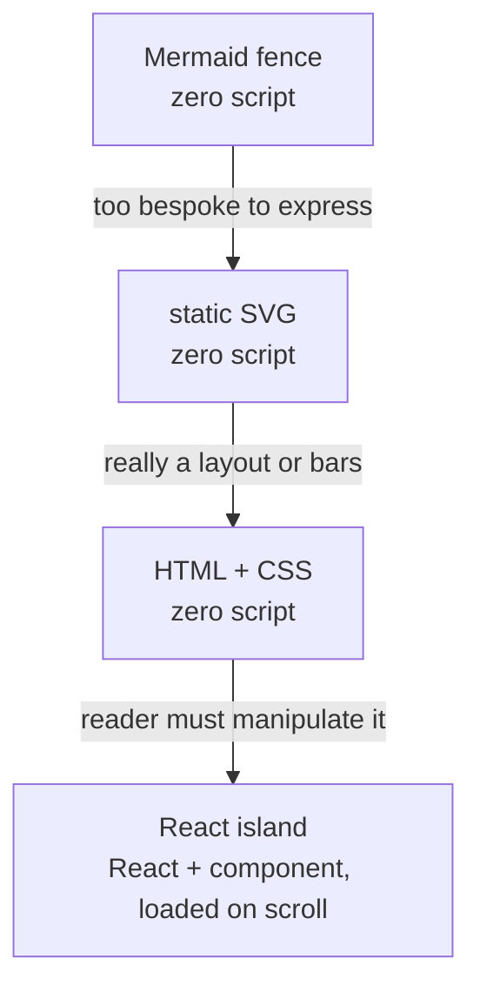

import Callout from "@/components/blog/Callout.astro";
import Figure from "@/components/blog/Figure.astro";
import VizFigure from "@/components/blog/VizFigure.astro";
import Quote from "@/components/blog/Quote.astro";
import Aside from "@/components/blog/Aside.astro";
import Comparison from "@/components/blog/Comparison.astro";
import Steps from "@/components/blog/Steps.astro";
import Details from "@/components/blog/Details.astro";
import Tabs from "@/components/blog/Tabs.astro";
import Tab from "@/components/blog/Tab.astro";
import CodeBlock from "@/components/blog/CodeBlock.astro";
import { Image } from "astro:assets";
import pipeline from "./pipeline.png";
import Counter from "./components/Counter";
import Island from "./island.svg";

This blog is written mostly by coding agents, and that changes what "easy to author" means. The
easiest thing for an agent is a small, explicit vocabulary with a validator that says exactly
what went wrong — not a big flexible one with conventions you have to remember.
[Part 1](/an-agent-built-this-blog/) covered the validators; this part is the vocabulary. Every
component the site's posts are written with appears below, in the order an author reaches for
them, doing its actual job — this page is its own demo. It ends at the top of the ladder: the one
place JavaScript earns its way into a post.

<Aside>
  Posts are MDX files in their own directories, next to their images and any post-specific
  components. The shared primitives are catalogued in one README and styled by one token file.
</Aside>

## Why static first

A blog post is a document. Documents do not need a JavaScript framework to be read, and every
kilobyte of script is a kilobyte the reader downloads before the text settles. So the rule: a
prose, code, or diagram post ships **zero external scripts** — no React, no framework runtime,
nothing but a few lines of inline script for the theme toggle, the table of contents, and a
couple of the primitives below. The e2e suite enforces it as a budget: `script[src]` count on a
prose page must be exactly zero.

<Comparison labels={["Static primitive", "Hydrated island"]}>
  <Fragment slot="a">

    - Rendered once, at build time
    - Works with JavaScript disabled
    - Styled by the same tokens as everything else
    - Zero bytes of framework script

  </Fragment>
  <Fragment slot="b">

    - Ships React plus the component
    - Needed for real interactivity (state, input, animation)
    - Loaded lazily, usually when scrolled into view
    - Justified per post, never by default

  </Fragment>
</Comparison>

Everything until the last section is in the first column.

## Prose, code, and images

Plain Markdown covers most of a post: paragraphs, links, lists, emphasis, and fenced code with
syntax highlighting that switches with the theme.

```ts
// Frontmatter dates are UTC calendar dates; render them only through this helper.
export function formatDate(date: Date, style: "medium" | "long" = "medium"): string {
  return new Intl.DateTimeFormat("en-US", { dateStyle: style, timeZone: "UTC" }).format(date);
}
```

Images live next to the post and go through Astro's image pipeline: resized variants,
`srcset`, intrinsic dimensions, and lazy loading, from a single line of Markdown.


When an image needs a caption or a wider measure than the text column, it goes in a `Figure`:

<Figure
  caption="The same image, wrapped in a Figure with a caption and a wide breakout."
  width="wide"
>
  <Image
    src={pipeline}
    alt="A schematic card on a grid background, rendered wider than the text column"
  />
</Figure>

Tables are plain Markdown too. Every table is automatically wrapped so that on narrow screens it
scrolls sideways inside its own box instead of pushing the page wider — the author does nothing:

| Check                     | Where it runs   | Fails the build? |
| ------------------------- | --------------- | ---------------- |
| Frontmatter schema        | content loader  | yes              |
| Unknown series or tag     | type system     | yes              |
| Duplicate/reserved slug   | `validatePosts` | yes              |
| axe WCAG 2.2 AA           | e2e             | yes              |
| Horizontal overflow @360w | e2e             | yes              |

## Emphasis without shouting

Two components handle "the reader should notice this", and they are deliberately different.

<Callout variant="tip" title="When to use which">
  A **Callout** interrupts the flow — use it for things a reader will regret skipping. An **Aside**
  steps out of the flow — use it for context that is interesting but optional.
</Callout>

<Callout variant="warning">
  Warnings look like this. There is also `danger` for "this will lose data" and `info` for neutral
  context. Five variants, and no post is allowed to invent a sixth colour.
</Callout>

Quotations get attribution and, when there is one, a source link:

<Quote
  cite="Fred Brooks, The Mythical Man-Month"
  href="https://en.wikipedia.org/wiki/The_Mythical_Man-Month"
>
  Plan to throw one away; you will, anyhow.
</Quote>

## Procedures and alternatives

Steps are an ordered list with a connector line — the Markdown stays a plain `1.` list, so it
degrades to exactly that anywhere else the text is shown.

<Steps>

1. Create `src/content/posts/<slug>/index.mdx` with valid frontmatter (a scaffold script does this).
2. Write the post using the primitives on this page. Put images and any components next to it.
3. Run `npm run validate` and `npm run build`. If anything is off — an unknown tag, a duplicate series order, a missing alt — the build says what and where.
4. Set `draft: false` and push. CI builds, runs the accessibility suite, and deploys.

</Steps>

Tabs are for _equivalent_ alternatives, never for hiding content. Arrow keys move between them,
Home and End jump to the first and last, and without JavaScript the panels simply stack.

<Tabs>
  <Tab label="Markdown image">

    ```mdx
    
    ```

  </Tab>
  <Tab label="Figure with caption">

    ```mdx
    <Figure caption="What the diagram shows." width="wide">
      <Image src={diagram} alt="Alt text that describes the image" />
    </Figure>
    ```

  </Tab>
</Tabs>

Long, optional material folds away — a native `<details>` element, no script:

<Details summary="The full frontmatter contract">

  - `title` (≤ 60 characters — it is the post's entire `<title>`)
  - `description` (40–160 characters, used for search snippets and social previews)
  - `publishedAt`, optional `updatedAt` (never earlier than `publishedAt`)
  - `series` (must exist in the registry) and `seriesOrder` (unique within the series)
  - `tags` (each must exist in the registry)
  - `authority` (the repository that owns this post's domain facts — see [part 3](/repos-as-experts/))
  - `draft` (drafts are dev-only: never built, listed, fed, or indexed)
  - `hero { src, alt }` (required, 1200×630) and optional `ogImage`

</Details>

## Code that wants a name

Bare fenced code is the default. When a snippet is a file, or long enough that someone will want
to copy it, `CodeBlock` adds a header and a copy button — one small script for the whole page,
not per block, and the "Copied" confirmation is announced to screen readers.

<CodeBlock title="src/lib/url.ts">

```ts
/** Build a site-relative href that respects Astro's base. Never hardcode "/blog/". */
export function href(path: string): string {
  const base = import.meta.env.BASE_URL.replace(/\/$/, "");
  return `${base}${path.startsWith("/") ? path : `/${path}`}`;
}
```

</CodeBlock>

## Diagrams and math

Diagrams are Mermaid fences rendered to SVG **at build time** — the reader gets a picture, not a
script that draws one. Every diagram gets a sentence describing it and `accTitle`/`accDescr`
lines inside the fence, because a picture without words is invisible to a screen reader. This one
shows the path from an MDX file to a deployed page:



One honest footnote: Mermaid renders once in a neutral light theme, and dark mode is a CSS invert
filter — a deliberate shortcut, unlike the hand-drawn SVGs on this site, which follow the theme
natively through `currentColor`.

Math uses TeX syntax and renders through KaTeX, also at build time. Inline, reading time is
$\max(1, \operatorname{round}(w / 230))$ minutes for $w$ words; the display form of the same idea:

$$
t_{\text{read}} = \max\left(1, \operatorname{round}\left(\frac{w}{230}\right)\right)
$$

Neither diagrams nor math adds a byte of JavaScript to the page.

## The ladder

There is no chart library on this site, no carousel, no embed component. Each would be a
dependency and a maintenance promise, and nothing above needed one. When a post wants a visual,
the house rule is a ladder — stop at the first rung that holds:



A chart with fixed data is an SVG. A chart the reader can filter is an island. That last rung is
the rest of this post.

## Islands, not apps

Astro renders every page to static HTML. A component marked with a `client:*` directive is an
_island_: it renders to HTML at build time like everything else, and then, in the browser, only
that component's JavaScript loads and takes over its own DOM. The rest of the page never
hydrates.

<Figure caption="One island in a sea of static HTML. Only the highlighted block loads script.">
  <VizFigure
    name="A page outline with one hydrated island"
    summary="Most of the page is plain text blocks; a single small block near the bottom is highlighted as the island, so client JavaScript is a small fraction of the document."
  >
    <Island class="h-auto w-full max-w-xl" />
  </VizFigure>
</Figure>

Below is the smallest possible island — a counter — living in this post's own directory as
`components/Counter.tsx`. It hydrates when scrolled into view (`client:visible`), so a reader who
never gets this far never downloads it.

<VizFigure
  name="Counter demo"
  summary="A button that counts its own clicks; the count updates without a page reload."
  interactive
>
  <Counter client:visible />
</VizFigure>

```mdx
import Counter from "./components/Counter";

<Counter client:visible />
```

That is the entire authoring surface for interactivity: import a component that lives next to
the post, add a directive. The component is ordinary React built from the same design tokens as
the site chrome — an island cannot invent its own look, so demos age with the theme instead of
against it — and it has an ordinary unit test next to it.

Good reasons for an island:

- The reader manipulates it: sliders, filters, a search box, a playground.
- It animates in a way CSS cannot express, and the animation carries meaning.
- It fetches or computes something on demand that would be absurd to precompute.

Bad reasons:

- It was easier to write in React. (It is usually not, once you count the hydration.)
- A library exists for it. (The library is now the reader's download.)
- Everything else on the site is React. (Almost nothing on this site is React.)

Post-specific components stay in the post's directory, with their tests, and are promoted to the
shared library only when a second post needs the same thing — which is also when it becomes
worth designing an API for. Site chrome — header, footer, theme toggle — is never an island;
those are plain Astro with a few lines of inline script. The one exception in the whole site is
the [archive explorer](/all-posts/): full-text search, tag and series filters, and sortable
listings genuinely need to respond to the reader, so that page hydrates one island and lazily
fetches its search index.

Every primitive on this page was placed by an agent following the same catalogue you have just
read. How a post actually gets written, reviewed, and shipped — including the part where other
repositories are consulted as domain experts — is [part 3](/repos-as-experts/).
