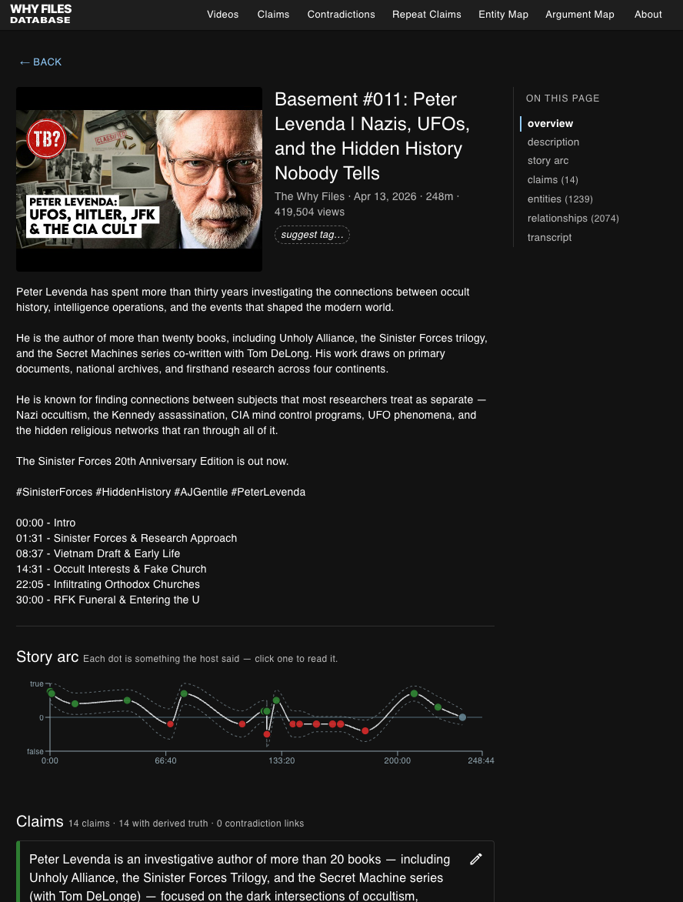
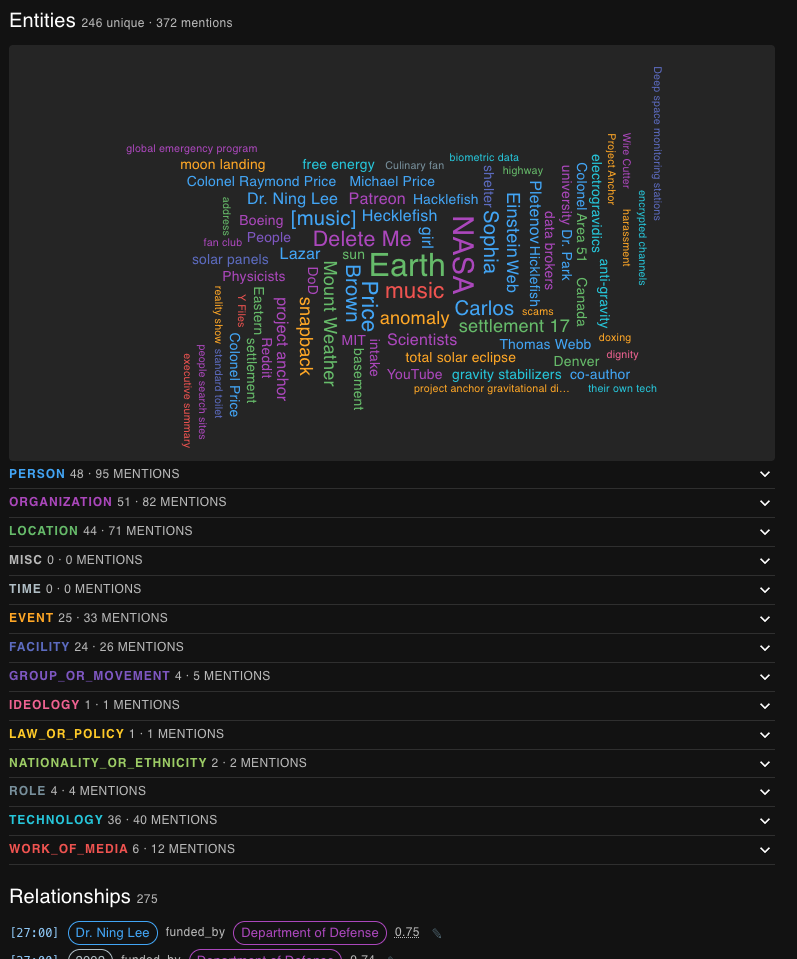
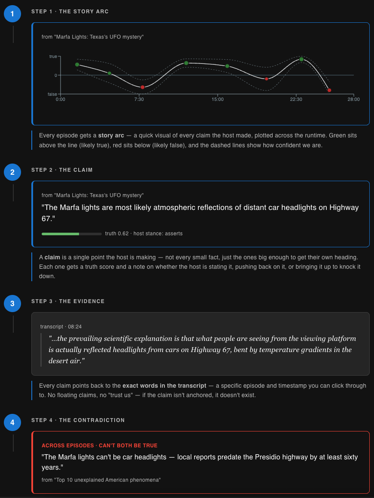
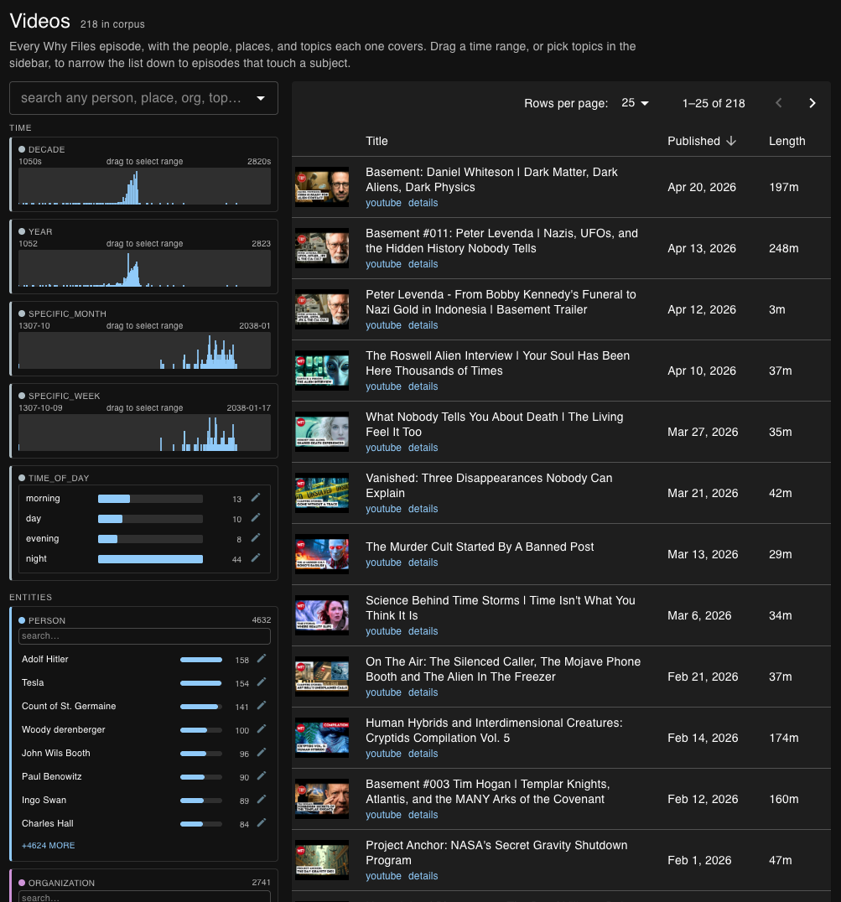
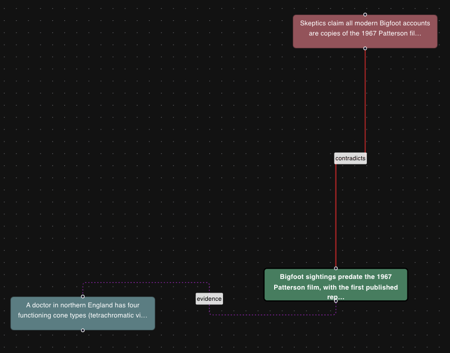

import { Image } from "astro:assets";
import entityRollupNasa from "./entity-rollup-nasa.png";
import relationshipGraphCarlAllen from "./relationship-graph-carl-allen.png";
import claimsListKersey from "./claims-list-kersey.png";
import contradictionsBrowser from "./contradictions-browser.png";
import argumentMapCia from "./argument-map-cia.png";
import counterfactualSlider from "./counterfactual-slider.png";
import Figure from "@/components/blog/Figure.astro";
import VizFigure from "@/components/blog/VizFigure.astro";
import CouplingWeights from "./coupling-weights.svg";
import VerdictDistribution from "./verdict-distribution.svg";
import PipelineViz from "./pipeline-viz.svg";
import VerdictRoutingViz from "./verdict-routing-viz.svg";

**Live site:** [jonborchardt.github.io/WFD](https://jonborchardt.github.io/WFD/)

**Source:** [github.com/jonborchardt/wfd](https://github.com/jonborchardt/wfd)

## The problem

[The Why Files](https://thewhyfiles.com) is a YouTube show — AJ Gentile and his team produce long, well-researched episodes on UFOs, ancient mysteries, conspiracies, cryptids, and the kind of story that sits between "documented" and "fringe." It's good fun. More than a hundred episodes in, the show carries something the format can't show you directly: a **story across episodes**. A claim laid out firmly in one video gets walked back two videos later. A debunking in episode 80 quietly contradicts a presupposition in episode 12. A name (Bigfoot, Roswell, Project Blue Book, Tesla) keeps coming back, and the host's posture toward it shifts.

A viewer who's seen every episode carries that map in their head. Anyone else is starting from scratch.

YouTube's search bar can't help with this. "Every time the host laid out a fringe idea fairly but didn't endorse it" isn't a query you can type. Neither is "every place two episodes disagree about the same event," or "every claim whose evidence quietly leans on something the host himself rejected elsewhere."

I wanted that map visible. So I built it.

## What it is

The **Why Files Database** is a public, read-only research index of every publicly available Why Files transcript. As of this writing it covers **218 episodes**. It's not a clip search. It's a structured graph:

- Every **person, organization, place, facility, event, date, technology, book/movie, ideology** the show has talked about, with per-entity rollups across every episode.
- Every relationship between those entities. Twenty-nine typed predicates: located_in, founded, member_of, authored, denies, funded_by, and more — with a transcript span pointer on every single edge so you can jump straight to the moment in the video where the claim was made.
- **Thesis-level claims per episode** — 8–15 per video as the target, each one with a truth score, confidence score, the host's stance toward it (`asserts` / `denies` / `uncertain` / `steelman`), expandable evidence quotes, and dependency links to other claims (`supports` / `contradicts` / `presupposes` / `elaborates`).
- A **contradiction browser** — pair / broken-presupposition / cross-video / manual — surfacing every place the show contradicts itself, and every place one episode's evidence depends on something another episode rejected.
- A **cross-video agreements** page — the flip side, where two different episodes assert the same thesis (positive corroboration).
- An **entity graph** with a "color by truth" overlay — edges shaded red→green based on how the corpus actually treats those claims (nodes keep their entity-type colours).
- An **argument map** — claims-as-nodes with dependency, contradiction, and shared-evidence edges, seedable by any entity, video, or single claim.
- A **counterfactual mode** — "if this claim were false, which other claims move, and by how much?"
- A **suggest-an-edit** flow on every entity, relationship, claim, and contradiction — opens a prefilled GitHub issue with a one-click admin apply link.

<Figure caption="Entity rollup for NASA: 334 mentions across 61 videos, each with the timestamps where it comes up.">
  <Image src={entityRollupNasa} alt="The NASA entity page listing seven episodes with thumbnail, title and bracketed transcript timestamps for every mention" />
</Figure>

<Figure caption="The relationship graph around one entity. Every edge is a typed predicate with a span pointer back to the transcript.">
  <Image src={relationshipGraphCarlAllen} alt="A node-link graph centred on Carl Allen with edges labelled member_of to US Navy, works_for to Office of Navy Research, authored to The Case of the UFO, and denies from Goldi and Jessopp" />
</Figure>

<Figure caption="The claims list for an episode: truth and confidence bars, host stance, evidence quotes with timestamps, dependencies and a why? rationale.">
  <Image src={claimsListKersey} alt="Three claim cards from the Kersey time-slip episode, the first expanded to show a leans-false 0.40 direct truth, host asserts, an evidence quote at 00:10, an elaborates dependency and a rationale paragraph" />
</Figure>

<Figure caption="The contradictions browser: paired claim cards with stance banners, truth bars, source episodes and shared-entity chips; filters by kind, similarity and publish date on the left.">
  <Image src={contradictionsBrowser} alt="The contradictions page showing 35 contradictions in the corpus as side-by-side red DENIES and green ASSERTS cards, with faceted filters for kind, cross-video match, shared entities, text similarity and publish date" />
</Figure>

<Figure caption="The argument map seeded from a single claim; dotted edges are shared evidence, coloured nodes are truth.">
  <Image src={argumentMapCia} alt="An argument map graph with a highlighted central claim about CIA mind control programs and about fifteen surrounding claim nodes coloured green or red, joined by dotted evidence edges" />
</Figure>

<Figure caption="Counterfactual mode on a claim: pin its truth to false and watch which dependent claims move.">
  <Image src={counterfactualSlider} alt="A claim card with a counterfactual slider pinned to 0.00 false, showing one shift: a related claim drops from very likely true 0.90 to uncertain 0.54, a delta of minus 0.36" />
</Figure>

The rule, in one line: **no claim without evidence**. Every relationship, truth judgment, and contradiction carries a transcript id and character span.

## What I built

The whole thing is a seven-stage pipeline. Everything before the public site runs offline against transcripts on disk; the site is static JSON plus a React front end.

<VizFigure
  name="The Why Files Database pipeline"
  summary="Transcripts are fetched once and cached, then run through GLiNER and GLiREL sidecars for entities and relations, canonicalised with an aliases file, read by an AI session that writes claims, processed by a pure-code reasoning layer into derived truth and contradictions, gated by a 49-signal metrics check, and finally emitted as static JSON for a React site on GitHub Pages. Transcript spans travel from ingest all the way to the public site, on every edge and quote."
>
  <PipelineViz class="mx-auto h-auto w-full max-w-2xl" aria-hidden="true" />
</VizFigure>

### 1. Ingest

A polite YouTube transcript fetcher with rate limiting and a never-refetch rule — once we have a transcript on disk, we never re-fetch it. The catalog tracks what we have, what's missing, and what stages are stale per video.

### 2. Neural extraction (entities + relations)

The first version used regex patterns and BERT NER, and it hit a quality ceiling fast — too many false positives, too many missed entities, no good way to handle relations at all.

The current version uses two zero-shot neural models running as Python sidecars:

- **GLiNER** for entity extraction. Thirteen typed labels — `person`, `organization`, `group_or_movement`, `location`, `facility`, `event`, `date_time`, `role`, `technology`, `work_of_media`, `law_or_policy`, `ideology`, `nationality_or_ethnicity`. Zero-shot means the labels live in a config file — adding a new one is a one-line change, not a retraining run. (A few labels — `role`, `law_or_policy` — are extracted and then wholesale dropped at curation; they never reach the public index.)
- **GLiREL** for relation extraction. Twenty-nine typed predicates, with a confidence threshold tuned against the corpus — the config supports per-predicate thresholds, though today all 29 share one value. Every edge carries the exact sentence span it was extracted from.

Node spawns the Python sidecars per transcript, one batched call each, and parses the JSON back. If Python is missing or a sidecar errors, the pipeline logs a warning and keeps going — graceful degradation.

There's no regex in the extraction path anymore. The old `src/nlp/` module was deleted.

### 3. Cross-transcript canonicalization

Neural extraction gives you "Dan" in one video, "Dan Brown" in another, and "D. Brown" in a third. They're all the same person. It also gives you generic noise — "channel," "music," `[music]` cue tags from the transcript — that you don't want in the graph.

The fix is a sectioned aliases file (`data/aliases.json`) holding corpus merges, deletions, display-name overrides, per-video merges, per-edge deletions, claim-level truth and field overrides, operator-authored contradictions and dismissals, and the curation memory (not-the-same rulings, dismissed clusters). An admin UI at `/admin/aliases` lets you curate by hand; a heuristic script proposes the obvious cases automatically; an AI audit pass handles the long tail; and a committed `delete-always.ts` file holds code-level decisions (PR-reviewed, auto-applied on every rebuild) in three lists: things that should never be in the graph on this corpus — role-noun persons like "the host," tautologies, transcript artifacts — whole labels to drop, and promotions that merge famous-name short forms like `person:tesla` → `person:nikola tesla`.

### 4. Per-video AI claim extraction

Entities and relations are low-level facts. They tell you "Tesla `works_for` Westinghouse" but not "the host believes Tesla's wireless power demonstrations were suppressed by financial interests." That second thing is a **claim** — a thesis-level proposition, the kind of proposition that could anchor a Wikipedia section, debatable, with stance and evidence.

For each video, an AI session reads the transcript plus the extracted entities and relations and writes claims to `data/claims/<id>.json` — the prompt targets 8–15 per video; in practice the corpus runs 8–24, averaging about 14. Each claim has:

- **Text** — atomic, single proposition. Compound "X and Y" claims get split and linked.
- **Kind** — `factual` / `interpretive` / `predictive` / `narrative`.
- **Host stance** — `asserts` / `denies` / `uncertain` / `steelman`. The `denies` case is important: when the host presents a claim _in order to reject it_ ("some people say X, but…"), the X-claim is extracted with `hostStance: "denies"`. Without this, the cross-video contradiction detector can't tell agreement from rebuttal.
- **Evidence quotes** — single-sentence spans, 60–150 char target. Multiple narrow quotes beat one paragraph-sized blob. Every quote has to match the transcript byte-for-byte; the validator rejects payloads where it doesn't.
- `directTruth` — calibrated, not vague. Omitted when there's no basis for judgment. Set only when the host gives a verdict, the claim cites primary evidence, or the proposition has widely-documented factual grounding.
- **Dependencies** on other claims — `supports` / `contradicts` / `presupposes` / `elaborates`. The `contradicts` rationales carry a typed subkind in a leading tag — `[logical]` / `[debunks]` / `[alternative]` / `[undercuts]` — that drives how strongly the contradicting claims couple in truth propagation.
- **Tags** — free-form, for filtering.

Claim files stamp `promptVersion: "v2"`; the metrics gate enforces that every file in the corpus is on the latest prompt version. If I update the prompt, I have to either backfill or fail the gate.

### 5. Reasoning layer (pure code)

The reasoning layer sits on top of the claim DAG and computes:

- **Derived truth** per claim, propagated through dependency edges with type-aware coupling. Logical and debunking contradictions pull at full weight. `alternative` (competing explanations) pulls at half weight — competing theories shouldn't hammer each other to zero. `undercuts` (one claim weakening another's evidence) doesn't pull at all but applies a post-cap on the target's truth at `1 - 0.2 * sourceTruth * sourceConfidence`.
- **Pair contradictions** within a single video. Surfaced only when both sides are asserted true and the dep subkind is `logical` or `debunks` (otherwise it's not a contradiction, it's the host delivering a verdict).
- **Broken-presupposition contradictions** — a high-truth claim standing on a low-truth foundation: the claim scores at least 0.5 while a claim it presupposes scores under 0.3. The truth-asymmetry requirement keeps chains between two equally-fringe claims from surfacing.
- **Cross-video contradictions** — sentence-transformer embeddings (with Jaccard fallback) generate candidate pairs; an AI verification pass verdicts each one as `LOGICAL-CONTRADICTION` / `DEBUNKS` / `UNDERCUTS` / `ALTERNATIVE` / `COMPLEMENTARY` / `IRRELEVANT` / `SAME-CLAIM`. Only the first four surface as contradictions on the public site; `SAME-CLAIM` is promoted to the cross-video agreements page; `COMPLEMENTARY` and `IRRELEVANT` drop. `verified: null` candidates are admin-only — the public never sees an unverified contradiction.
- **Counterfactual queries** — "if claim X were false, what moves?" replays propagation with X pinned and shows the deltas.

The four `contradicts` subkinds are not equal in propagation. This is the coupling each one applies:

<Figure caption="Coupling weight per contradicts subkind during truth propagation. Undercuts never pulls; it clamps the target's truth to at most 1 - 0.2 x sourceTruth x sourceConfidence.">
  <VizFigure
    name="Truth-propagation coupling weight by contradicts subkind"
    summary="Logical and debunks edges couple at full weight 1.0, alternative edges at half weight 0.5, and undercuts edges at zero pull, applying a post-cap on the target's truth instead."
    data={{
      caption: "Coupling weight by contradicts subkind",
      columns: ["Subkind", "Coupling weight", "Extra effect"],
      rows: [
        ["logical", "1.0", "none"],
        ["debunks", "1.0", "none"],
        ["alternative", "0.5", "none"],
        ["undercuts", "0", "caps target truth at 1 - 0.2 x sourceTruth x sourceConfidence"],
      ],
    }}
  >
    <CouplingWeights class="h-auto w-full max-w-2xl" />
  </VizFigure>
</Figure>

Cross-video candidates go through a verification step before anything is public. Here is where each verdict ends up:

<VizFigure
  name="Cross-video candidate pairs and where each verdict goes"
  summary="Sentence-transformer embeddings with a Jaccard fallback propose candidate claim pairs. An AI verification pass assigns one of seven verdicts. Logical contradiction, debunks, undercuts and alternative surface on the public contradictions page; same-claim goes to the cross-video agreements page; complementary and irrelevant are dropped; unverified candidates stay admin-only."
>
  <VerdictRoutingViz class="mx-auto h-auto w-full max-w-2xl" aria-hidden="true" />
</VizFigure>

### 6. Quality metrics

Every claim, contradiction, alias, and entity feeds a 49-signal metrics module. Five sections — entity hygiene, entity resolution, claims, contradictions, operator corrections. A committed baseline + per-metric target bounds gate every commit; `npm run metrics:check` fails the build on regression. The gate is **direction-aware** — a metric drifting in the "better" direction (more claims with calibrated truth, lower median evidence quote length, more typed contradicts) doesn't trip the gate even if it crosses the tolerance.

`/admin/metrics` renders the dashboard live: 49 live metrics, colored by regression status against baseline.

### 7. Public site

A standalone React + TypeScript + Vite project under `web/`, deployed to GitHub Pages. No server, no API, no database — every search, filter, and graph query runs client-side against pre-built JSON files served as static assets. Routes for the catalog, per-video detail, per-entity rollup, the relationships graph, the claims browser, the contradictions browser, the cross-video agreements page, the argument map, and the about page. Roughly 1.5 MB of JS for the graph view, code-split out so the rest of the site stays light.

The same React codebase has an admin mode, gated on `VITE_ADMIN`. In production the admin code is tree-shaken out entirely — no admin chunk in the deployed bundle. In local dev, Vite proxies `/api/*` to a Node server on `:4173` which serves the alias-mutation endpoints and runs the indexes stage in-process.

## What I learned building it

A few things that were not at all obvious when I started:

**Zero-shot beats a regex table for everything except artifacts.** GLiNER and GLiREL handle the entity and relation cases that used to need hundreds of lines of pattern code, and they generalize to new topics for free. Where they fail is the predictable junk — `[music]` cue tags, "the narrator," role nouns like "host" or "guest" that the model treats as person mentions. Those go in a code-level deletion list that auto-applies on every rebuild. The split between neural extraction for content and hard-coded filtering for noise turned out to work best. I tried both ends in isolation and neither worked.

**Stance is more important than truth.** Initially I had every claim get a `directTruth` score and that was it. The result was a mess of 0.3-confidence "factoids" where the host was clearly _rejecting_ the claim (he'd just laid out a fringe theory in order to debunk it), but the extractor scored it as low-confidence assertion. Adding `hostStance: "denies"` made the cross-video reasoning coherent — now if episode 80 rejects "the moon landing was faked" and episode 12 presupposes it, the contradiction surfaces correctly. Across the corpus today: 2,609 asserts, 234 denies, 91 uncertain, 73 steelman (and 83 unset) of 3,090 claims. Stance turned out to matter more than truth scores alone.

**Single-sentence evidence beats paragraph evidence.** The first claims prompt let the model pick "evidence" of any length. The model picked paragraphs. The result was a UI where every claim had a very long evidence quote that you couldn't actually verify — too much to cross-check, too much to skim. Forcing 60–150 character target evidence cleaned this up dramatically. Multiple narrow quotes per claim turned out to be much more useful than one long one — you could see _the specific sentences_ the extractor was keying on.

**Typed contradictions matter more than I thought.** Treating every "contradicts" edge identically meant that "two competing alternative explanations" pulled the truth of both to zero. That's wrong — they're competing, but neither is debunking the other. The typed-subkind tag (`[logical]` / `[debunks]` / `[alternative]` / `[undercuts]`) and the matching coupling weights in propagation made the truth scores much more stable.

**Cross-video contradictions need a verification pass.** Embedding-cosine similarity is _good_ at finding "two claims that talk about Tesla" and _bad_ at finding "two claims that disagree about Tesla." The first version of the contradictions page was mostly noise. Adding an AI verification step that verdicts every candidate pair as one of seven kinds before anything surfaces took the false-positive rate from "embarrassing" to "low single digits." The verdicts themselves make the point: of 141 candidate pairs the embeddings proposed, the single biggest bucket was two episodes _agreeing_.

<Figure caption="What 141 embedding-proposed candidate pairs actually turned out to be. Only the four contradiction classes — one strict logical contradiction, 7 debunks, 18 undercuts, 8 alternatives — are allowed to surface as contradictions; the biggest bucket, same-claim, is agreement and feeds the consonance page; complementary and irrelevant are dropped. A verdict only takes effect while its pair is still in the current candidate pool, so the live site shows fewer: 17 cross-video contradictions and 50 agreements today.">
  <VizFigure
    name="AI verdicts on 141 cross-video candidate pairs"
    summary="A bar chart of the seven verdict classes: same-claim 63, complementary 34, undercuts 18, irrelevant 10, alternative 8, debunks 7, and just one strict logical contradiction. Only 34 of the 141 pairs are contradiction-class; embeddings find topical overlap, and most overlap is agreement or noise."
    data={{
      caption: "Verdicts on 141 cross-video candidate pairs",
      columns: ["Verdict", "Pairs", "Eligible to surface as"],
      rows: [
        ["SAME-CLAIM", "63", "agreements page"],
        ["COMPLEMENTARY", "34", "dropped"],
        ["UNDERCUTS", "18", "contradiction"],
        ["IRRELEVANT", "10", "dropped"],
        ["ALTERNATIVE", "8", "contradiction"],
        ["DEBUNKS", "7", "contradiction"],
        ["LOGICAL-CONTRADICTION", "1", "contradiction"],
      ],
    }}
  >
    <VerdictDistribution class="h-auto w-full max-w-2xl" />
  </VizFigure>
</Figure>

**Operator corrections are high-value feedback.** Every time a human (me, mostly) hits "dismiss this contradiction" or "override this claim's truth" or "merge these two entities," that's signal. The aliases file stores it all, the metrics module counts it all, and the calibration bundle script feeds the most-confirmed examples back as few-shot context for future AI sessions. There's no training step involved, just example injection. The signal so far is almost entirely entity-level — over a thousand not-the-same rulings and hundreds of merges — and it noticeably improves new extractions.

**Local-first was the right call.** Transcripts and the derived index live on disk under `data/`, committed alongside the code, and the Pages deploy copies them straight into the static site. Builds are fast, extraction is offline, and the whole thing works without an internet connection once the transcripts are fetched.

## What's still rough

- **Dependency coverage is below target.** Only about 42% of claims carry dependency links, against an aspirational 55% — the metrics gate flags it on every run.
- **Skeptic scoring is still early.** It works (per-speaker credibility scores mostly from lexical signals — hedges, evasions, absolutes — plus how their claims have held up), but the calibration is rough.
- **Public site polish.** Mobile layout on the argument map page is cramped. The graph viewer occasionally hangs on very large neighborhoods.
- **The "novel links" report** (connections that emerge from combining multiple sources) is computed by the pipeline but has no UI yet — I'm still figuring out how to surface it without false positives.

## What you can do with it

Start with an episode you remember well. Open the [home page](https://jonborchardt.github.io/WFD/), pick an episode you remember well, and see if the claim list matches your memory. From there, click through to the contradictions page and see if any of them surprise you, then the argument map — seeded by Bigfoot or Roswell or Phantom Time — and walk the dependency chains.

If you spot something wrong — a bad claim, a missed contradiction, a wrongly-merged entity, a claim whose evidence quote is wrong — every page has a **suggest an edit** button that opens a prefilled GitHub issue. That's the contribution path. Corrections go through Git so they're auditable.

If you're curious about the build, all the code is on [GitHub](https://github.com/jonborchardt/wfd). The README has the full setup; CLAUDE.md has the deeper architecture notes.

## A note on the source material

All transcripts belong to [The Why Files](https://thewhyfiles.com) and AJ Gentile. This is an independent research index, not affiliated with, endorsed by, or operated by the show. If you enjoy The Why Files, please support them directly: [Patreon](https://www.patreon.com/thewhyfiles), [Shop](https://shop.thewhyfiles.com), or [YouTube](https://www.youtube.com/@TheWhyFiles).

The point of this project is to make the show _more_ fun to engage with, not to summarize it away. If you find a contradiction that's interesting, the most rewarding thing you can do is click through to the transcript span and watch the moment in the actual episode.

That was the goal from day one. **Trace claims back to the tape.**

---

_Built with TypeScript, Node, GLiNER, GLiREL, sentence-transformers, React, Vite, and Claude Code. Source on [GitHub](https://github.com/jonborchardt/wfd)._
